# Lapiz
A C graphics library build on top of Metal and Vulkan.

---

## Table of Contents

1. [System Overview](#1-system-overview)
2. [API Layers](#2-api-layers)
3. [Vulkan Backend](#3-vulkan-backend)
4. [Metal Backend](#4-metal-backend)
5. [Triple-Buffering & Frame Pacing](#5-triple-buffering--frame-pacing)
6. [C11 Performance Features](#6-c11-performance-features)
7. [Easy API — Implicit Path](#7-easy-api--implicit-path)
8. [Explicit API — Full Pipeline Control](#8-explicit-api--full-pipeline-control)
9. [Primitive Drawing System](#9-primitive-drawing-system)
10. [Text Rendering System](#10-text-rendering-system)
11. [Resource Management & Lifecycle](#11-resource-management--lifecycle)
12. [Backend Comparison Reference](#12-backend-comparison-reference)

---

## 1. System Overview

Lapiz is a cross-platform rendering library built on top of Vulkan and Apple Metal. It exposes **two distinct usage modes**: a high-level *easy API* that manages the entire render loop implicitly, and a low-level *explicit API* that gives the caller full control over every GPU object. Internally, both modes share the same backend infrastructure.

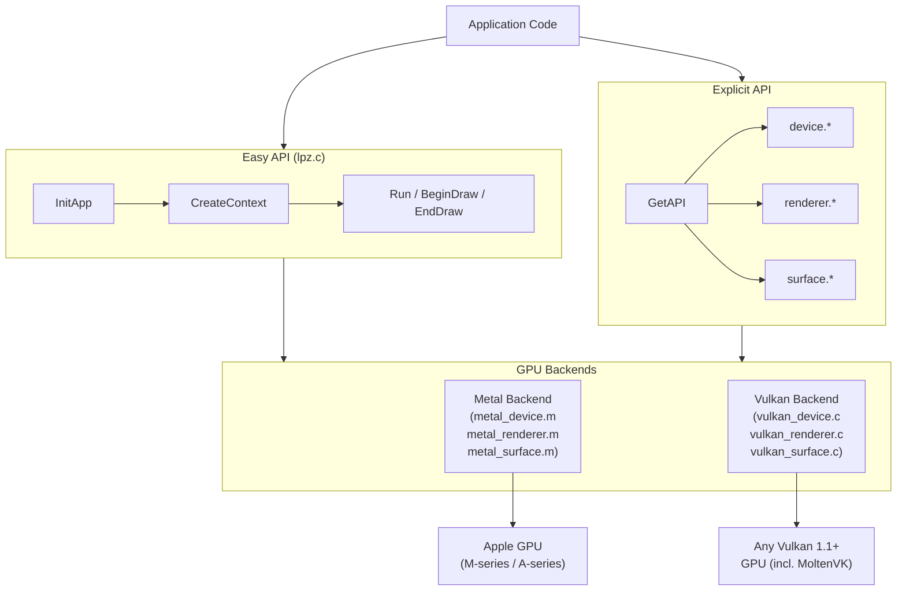

### Key Design Principles

| Principle | Implementation |
|---|---|
| **Zero-allocation hot path** | Frame arena bump allocator; stack buffers for transient queries |
| **State diffing** | Cached pipeline / viewport / scissor — GPU command only on change |
| **Triple-buffering** | `LPZ_MAX_FRAMES_IN_FLIGHT = 3` ring buffers for all dynamic data |
| **Atomic counters** | `_Atomic uint32_t` draw counter reset per frame, no mutex |
| **Backend parity** | Both backends implement identical `LpzRendererAPI` function tables |
| **Deferred destruction** | GPU objects queued for release only after their frame slot retires |

---

## 2. API Layers

The entire public surface is stored in a single `LpzAPI` struct that is populated at `InitApp` time. Every backend function is reached through a function pointer in this table — there are no virtual functions, no vtables, and no runtime dispatch overhead beyond a single pointer dereference.

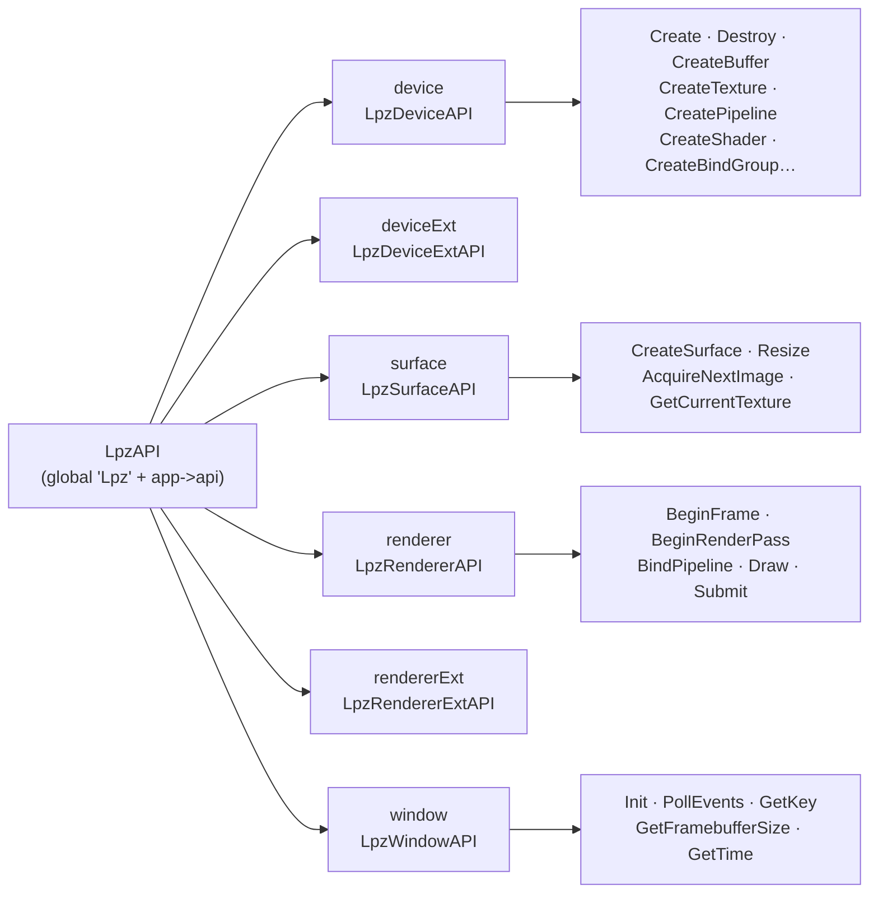

The macro `LPZ_MAKE_API_METAL()` / `LPZ_MAKE_API_VULKAN()` fills this table at compile-time with the correct backend's static function pointers. No heap allocation is involved; the table is a plain C struct copied by value during `InitApp`.

---

## 3. Vulkan Backend

### 3.1 Device Creation Sequence

Device creation in `vulkan_device.c` follows a strict ordered sequence of probes and capability negotiations:

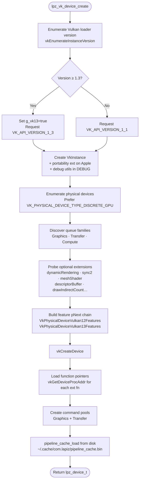

#### Queue Family Strategy

Lapiz discovers three queue families and falls back gracefully:

| Queue | Selection Rule | Fallback |
|---|---|---|
| **Graphics** | First family with `VK_QUEUE_GRAPHICS_BIT` | Error (required) |
| **Transfer** | Transfer-only family (no GRAPHICS bit) | Graphics family |
| **Compute** | Compute-only family (no GRAPHICS bit) | Graphics family |

This allows async DMA uploads on discrete GPUs (which have dedicated DMA engines) while working transparently on integrated and Apple Silicon devices.

### 3.2 Extension Feature Flags

All optional features are stored as **module-level `bool` globals** in `vulkan_device.c` and declared `extern` in `vulkan_internal.h`. This lets every translation unit read the flags without passing context pointers through every call:

```c
extern bool g_vk13;            // Vulkan 1.3 core features (sync2, dynRender)
extern bool g_has_sync2;       // VK_KHR_synchronization2
extern bool g_has_dynamic_render;  // vkCmdBeginRenderingKHR
extern bool g_has_ext_dyn_state;   // dynamic depth/stencil state
extern bool g_has_mesh_shader;     // VK_EXT_mesh_shader
extern bool g_has_draw_indirect_count;
extern float g_timestamp_period;
```

The corresponding function pointers are loaded with `vkGetDeviceProcAddr` once at device create time and stored alongside the flags:

```c
PFN_vkCmdBeginRenderingKHR g_vkCmdBeginRendering = NULL;
PFN_vkCmdPipelineBarrier2KHR g_vkCmdPipelineBarrier2 = NULL;
```

### 3.3 Swapchain & Surface

The surface layer (`vulkan_surface.c`) negotiates all parameters at creation time and persists them across resizes:

```mermaid
flowchart TD
    SC([lpz_vk_surface_create]) --> VK[Lpz.window.CreateVulkanSurface\n→ VkSurfaceKHR]
    VK --> FMT[Query surface formats\nstack buffer ≤32, heap fallback]
    FMT --> NEG{Preferred format\nRGB10A2 / RGBA16F / BGRA8}
    NEG -- HDR10 → A2B10G10R10 + ST2084
    NEG -- scRGB → R16G16B16A16 + EXTENDED_SRGB_LINEAR
    NEG -- SDR → B8G8R8A8_UNORM + SRGB_NONLINEAR
    FMT --> PM[select_present_mode\nMAILBOX → IMMEDIATE → FIFO]
    PM --> SW[vkCreateSwapchainKHR\nminImageCount = LPZ_MAX_FRAMES_IN_FLIGHT]
    SW --> IV[Build swapchain image views\ntexture_t per image with layout tracking]
    IV --> SEM[Create N semaphore pairs\nimageAvailable · renderFinished]
    SEM --> RET([Return lpz_surface_t])
```

#### Present Mode Fallback Chain

On MoltenVK (macOS), `VK_PRESENT_MODE_MAILBOX_KHR` is not supported. The two-pass search in `select_present_mode` avoids silently capping FPS:

```
Requested: MAILBOX
  Pass 1: search for MAILBOX     → not found
  Pass 2: foundSecondary (IMMEDIATE) → selected = IMMEDIATE
  → Log warning: "Requested present mode unavailable; using fallback (2 → 0)"

Requested: FIFO → return immediately (always available, no search needed)
```

#### Image Layout Tracking

Every `struct texture_t` carries two layout fields:

```c
VkImageLayout currentLayout;  // last-known layout
bool          layoutKnown;    // false until first barrier is issued
```

Before every render pass attachment, `lpz_vk_transition_tracked_texture` issues a precisely-scoped barrier using `currentLayout` as `oldLayout` instead of always specifying `VK_IMAGE_LAYOUT_UNDEFINED`. This avoids redundant driver transitions and prevents content loss on LOAD operations.

### 3.4 Render Pass (Dynamic Rendering)

Lapiz uses `VK_KHR_dynamic_rendering` (core in Vulkan 1.3) rather than render-pass objects. There are no `VkRenderPass` or `VkFramebuffer` handles anywhere in the codebase:

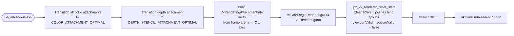

### 3.5 Submit & Frame Advance

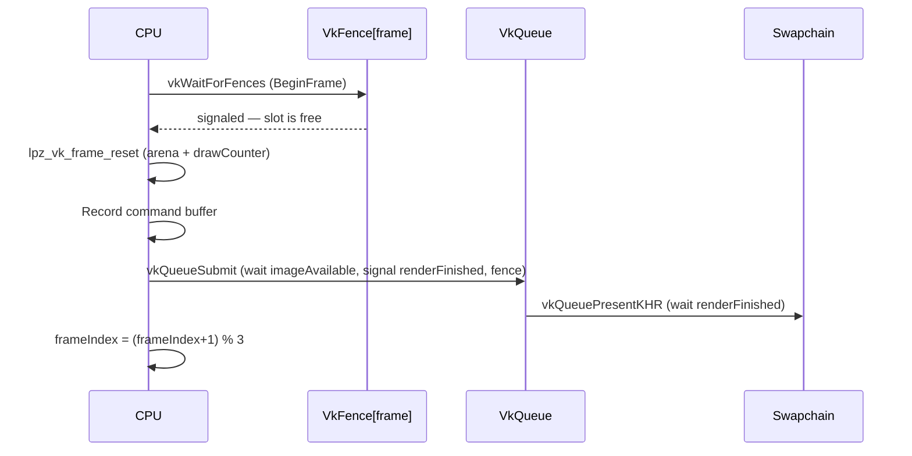

---

## 4. Metal Backend

### 4.1 Device Creation Sequence

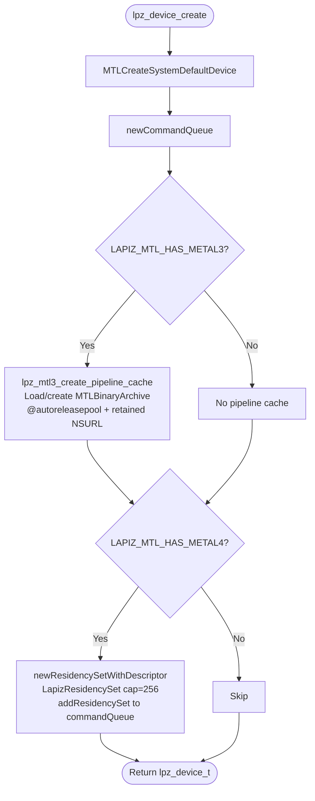

#### Metal Version Feature Tiers

The `LAPIZ_MTL_VERSION_MAJOR` macro is derived from `__MAC_OS_X_VERSION_MIN_REQUIRED` at compile time:

| Deployment Target | Metal Version | Features Unlocked |
|---|---|---|
| macOS 10.14+ | Metal 2 | Base feature set |
| macOS 13+ | Metal 3 | `MTLBinaryArchive` (pipeline cache), `MTLIOCommandQueue`, `dispatchThreads:` |
| macOS 26+ | Metal 4 | `MTLResidencySet`, `MTL4ArgumentTable`, argument buffers v3 |

### 4.2 Pipeline Cache (Metal 3)

Metal 3 provides `MTLBinaryArchive` for cross-launch pipeline caching. The cache helpers in `metal_internal.h` own the full lifecycle with careful autorelease pool management (required because teardown happens outside any active pool):

```mermaid
flowchart LR
    subgraph Create ["lpz_mtl3_create_pipeline_cache"]
        direction TB
        A1[@autoreleasepool] --> A2[lpz_mtl3_pipeline_cache_url\nretained NSURL]
        A2 --> A3{File exists?}
        A3 -- Yes --> A4[newBinaryArchiveWithDescriptor url:]
        A3 -- No --> A5[newBinaryArchiveWithDescriptor nil]
        A4 --> A6{Load ok?}
        A6 -- Fail --> A7[Delete stale file\nretry with nil url]
        A6 -- Ok --> A8[return archive]
        A7 --> A8
        A5 --> A8
        A2 --> A9[cacheURL release]
    end

    subgraph Flush ["lpz_mtl3_flush_pipeline_cache"]
        direction TB
        B1[@autoreleasepool] --> B2[lpz_mtl3_pipeline_cache_url\nretained NSURL]
        B2 --> B3[serializeToURL:error:]
        B3 --> B4{Error?}
        B4 -- Yes --> B5[removeItemAtURL\nDelete stale cache]
        B4 -- No --> B6[Done]
        B2 --> B7[url release]
    end
```

> **Why `@autoreleasepool` is mandatory here:** `lpz_mtl3_flush_pipeline_cache` is called from `lpz_device_destroy` → `CleanUpApp`, which is pure C teardown with no active pool. Without an explicit pool, all autoreleased ObjC objects (including Metal's internal objects inside `serializeToURL:`) are registered to the thread's root pool — which is already drained at that point. This is the root cause of the `EXC_BAD_ACCESS` crash inside `objc_retain` seen in `_MTLBinaryArchive`.

### 4.3 Renderer & Command Encoding


#### `retainedReferences=NO` and Deferred Destruction

When `MTLCommandBufferDescriptor.retainedReferences = NO`, Metal will **not** retain any resources referenced in the command buffer. This eliminates per-resource retain/release overhead in the hot path. The tradeoff is that the application must guarantee resource lifetime manually.

Lapiz handles this with a **deferred destruction queue** embedded in `struct renderer_t`:

```c
id<NSObject> pending_free[LPZ_MAX_FRAMES_IN_FLIGHT][LPZ_MTL_MAX_DEFERRED_FREE];
uint32_t     pending_free_count[LPZ_MAX_FRAMES_IN_FLIGHT];
```

Objects enqueued here are released at the **next `BeginFrame` that reuses the same slot** — which is guaranteed to be after the GPU has signaled the semaphore for that slot, making it safe to release.

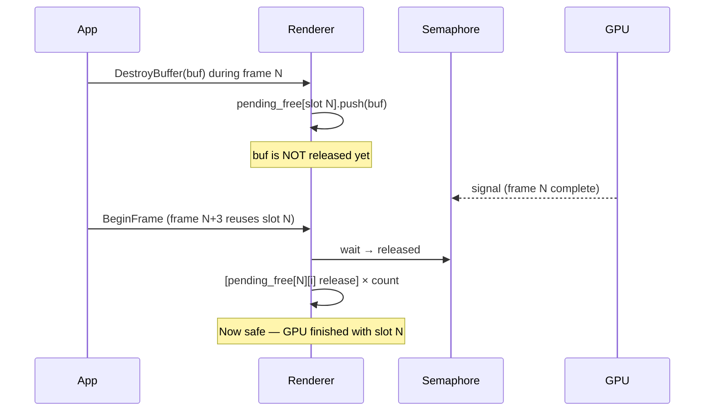

### 4.4 Normal Transform Optimization

The vertex shader `vertex_scene` transforms surface normals using an explicit `float3x3` extraction instead of a 4×4 multiply:

```metal
// Before (implicit 4x4 multiply with w=0 hint — compiler may not optimize):
out.normal_world = (model * float4(in.normal, 0.0)).xyz;

// After (explicit 3x3 — 9 muls + 6 adds vs 12 muls + 8 adds):
out.normal_world = float3x3(model[0].xyz, model[1].xyz, model[2].xyz) * in.normal;
```

---

## 5. Triple-Buffering & Frame Pacing

Both backends use **3 frame slots** (`LPZ_MAX_FRAMES_IN_FLIGHT = 3`) to allow the CPU to record frame N+1 while the GPU executes frame N.

```mermaid
gantt
    title Frame Pipelining (3 in-flight slots)
    dateFormat X
    axisFormat %s

    section CPU
    Record Frame 0      :a1, 0, 2
    Record Frame 1      :a2, 2, 4
    Record Frame 2      :a3, 4, 6
    Wait (slot 0 busy)  :crit, a4, 6, 7
    Record Frame 3      :a5, 7, 9

    section GPU
    Execute Frame 0     :b1, 2, 5
    Execute Frame 1     :b2, 5, 8
    Execute Frame 2     :b3, 8, 11
```

### Ring-Buffered Resources

Any resource that is written by the CPU and read by the GPU in the same frame must be ring-buffered. Lapiz marks buffers as ring-buffered at creation time:

```c
LpzBufferDesc bd = {
    .size = per_frame_size * LPZ_MAX_FRAMES_IN_FLIGHT,
    .ring_buffered = true,  // signals that size includes all slots
    .memory_usage = LPZ_MEMORY_USAGE_CPU_TO_GPU,
};
```

At bind time, the correct slot is selected:

```c
// Metal:
NSUInteger slot = buf->isRing ? (frameIndex % LPZ_MAX_FRAMES_IN_FLIGHT) : 0;
return buf->buffers[slot];

// Vulkan:
VkBuffer vk_buf = buffer->isRing ? buffer->buffers[renderer->frameIndex] : buffer->buffers[0];
```

### Resources That Are Ring-Buffered

| Resource | Why |
|---|---|
| Primitive SSBO (points, lines) | Written by CPU every frame with new draw data |
| Instance SSBO (DrawMeshInstanced) | Per-frame transform + color data |
| Text glyph SSBO | Rebuilt each frame from TextBatchAdd calls |
| Transient upload ring (Metal) | Sub-allocated within `lpz_renderer_alloc_transient_bytes` |

---

## 6. C11 Performance Features

### 6.1 Frame Arena (Bump Allocator)

Both backends embed a **64 KB frame-lifetime bump allocator** directly inside `struct renderer_t`. This eliminates all heap allocations in the per-frame hot path.

```
struct renderer_t memory layout:
┌────────────────────────────────────────────────┐
│  ... other fields ...                          │
├────────────────────────────────────────────────┤
│  _Alignas(16) char frameArena[65536]           │  ← 64 KB inline
├────────────────────────────────────────────────┤
│  size_t frameArenaOffset                       │  ← bump pointer
├────────────────────────────────────────────────┤
│  _Atomic uint32_t drawCounter                  │
└────────────────────────────────────────────────┘
```

**Allocation** — `O(1)` pointer arithmetic with 16-byte alignment:

```c
LAPIZ_INLINE void *lpz_vk_frame_alloc(struct renderer_t *r, size_t size) {
    size_t aligned = (size + 15u) & ~15u;           // round up to 16-byte boundary
    if (r->frameArenaOffset + aligned > LPZ_VK_FRAME_ARENA_SIZE)
        return NULL;                                 // exhausted → caller uses malloc
    void *p = r->frameArena + r->frameArenaOffset;
    r->frameArenaOffset += aligned;
    return p;
}
```

**Reset** — `O(1)` single store at `BeginFrame`:

```c
LAPIZ_INLINE void lpz_vk_frame_reset(struct renderer_t *r) {
    r->frameArenaOffset = 0;   // reclaim entire 64 KB in one store
    atomic_store_explicit(&r->drawCounter, 0, memory_order_relaxed);
}
```

**What uses the arena:**

| Allocation | Before (heap) | After (arena) |
|---|---|---|
| `VkRenderingAttachmentInfo colorAtts[]` in `BeginRenderPass` | `calloc(N, sizeof(...))` + `free(...)` | `lpz_vk_frame_alloc(renderer, N * sizeof(...))` |
| `VkCommandBuffer vkCmds[]` in `SubmitCommandBuffers` | `malloc(count * sizeof(...))` + `free(...)` | `lpz_vk_frame_alloc(renderer, count * sizeof(...))` |

The arena falls back to `malloc` only when exhausted (in practice: never for normal scenes, since 64 KB covers hundreds of attachment descriptors).

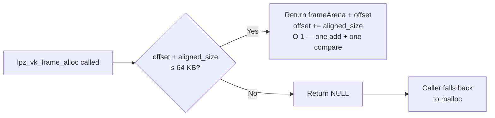

### 6.2 C11 Atomics — `_Atomic uint32_t drawCounter`

The draw counter is incremented in every `Draw` and `DrawIndexed` call using `memory_order_relaxed`. This is the weakest memory order: it guarantees no lost increments (atomicity) but imposes no ordering constraints on other memory operations — the cheapest possible atomic operation, typically compiling to a single `LDADD` (ARM) or `LOCK XADD` (x86).

```c
// In lpz_vk_renderer_draw / lpz_renderer_draw:
atomic_fetch_add_explicit(&renderer->drawCounter, 1, memory_order_relaxed);

// At BeginFrame (inside lpz_vk_frame_reset / lpz_mtl_frame_reset):
atomic_store_explicit(&renderer->drawCounter, 0, memory_order_relaxed);
```

`memory_order_relaxed` is correct here because the counter is a diagnostic counter — its value is only read at profiling time after the frame is complete, not used to synchronize any shared state.

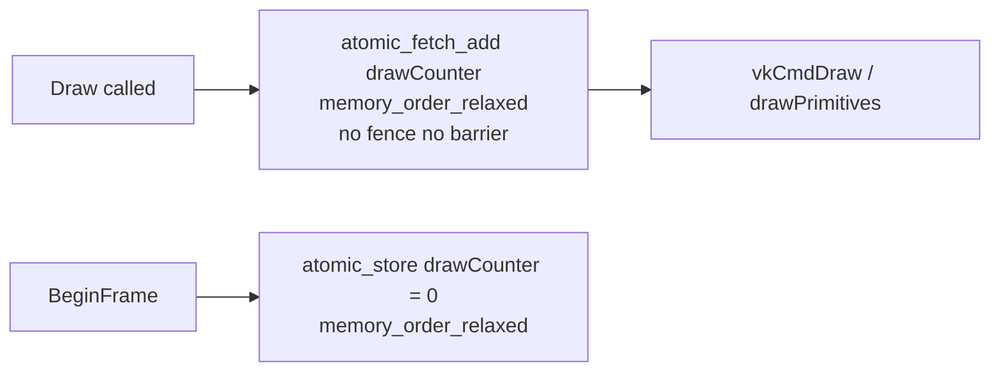

### 6.3 `_Alignas(16)` — SIMD-Safe Alignment

The frame arena is declared with `_Alignas(16)`:

```c
_Alignas(16) char frameArena[LPZ_VK_FRAME_ARENA_SIZE];
```

This ensures that the base of the arena is 16-byte aligned. Since each allocation is rounded up to a multiple of 16, every allocation is also 16-byte aligned. This is required for:
- `VkRenderingAttachmentInfo` which contains `VkClearValue` (16-byte aligned)
- `mat4` / `vec4` types in push constant structs (`LAPIZ_ALIGN(16)` in the easy API)
- Any SIMD loads/stores used in geometry processing

### 6.4 `_Thread_local` — Per-Thread Arenas (Prepared)

`internals.h` defines `LAPIZ_THREAD_LOCAL` as `_Thread_local` on C11 and later:

```c
#if defined(__STDC_VERSION__) && __STDC_VERSION__ >= 201112L
#define LAPIZ_THREAD_LOCAL _Thread_local
#else
#define LAPIZ_THREAD_LOCAL  // silent degradation on C99
#endif
```

The infrastructure is in place for thread-local allocators when multi-threaded command recording is added. Each thread would get its own bump pointer with no synchronization required, since `_Thread_local` storage is per-thread by definition.

### 6.5 `_Static_assert` — Compile-Time Layout Verification

Critical struct layouts that must match the GPU shader are verified at compile time:

```c
// geometry.h:
_Static_assert(sizeof(Vertex) == 48, "Vertex must be 48 bytes");
_Static_assert(offsetof(Vertex, normal) == 12, "normal at offset 12");
_Static_assert(offsetof(Vertex, uv) == 24, "uv at offset 24");
_Static_assert(offsetof(Vertex, color) == 32, "color at offset 32");

// lpz.c:
_Static_assert(sizeof(LpzPrimPC) == 80,
    "LpzPrimPC must be exactly 80 bytes to match the GPU push-constant range");
```

If padding is inadvertently introduced (e.g. by compiler struct reordering or a new field), the build fails immediately — no runtime mismatch possible.

### 6.6 `__builtin_expect` — Branch Prediction Hints

Performance-critical conditional paths are marked with `LAPIZ_LIKELY` / `LAPIZ_UNLIKELY`, which expand to `__builtin_expect` on GCC/Clang:

```c
// In lpz_cpu_push_points — fast path: buffer already large enough
if (__builtin_expect(need > app->prim_point_cap_cpu, 0))
{
    // slow path: realloc
}

// In lpz_flush_points — fast path: buffer already exists and is large enough
if (__builtin_expect(!app->point_buf || app->point_buf_cap < gpu_need, 0))
{
    if (!lpz_prim_ensure_gpu_buf(...))
        return;
}
```

The `0` (not-expected) hint tells the branch predictor that the slow path (realloc / buffer creation) is rare, keeping the predicted path through the fast `memcpy` inline.

### 6.7 `LAPIZ_INLINE` — Forced Inlining for Hot Helpers

All shared helpers in `vulkan_internal.h` and `metal_internal.h` are marked `LAPIZ_INLINE`:

```c
#define LAPIZ_INLINE static __inline__   // GCC/Clang
#define LAPIZ_INLINE static __inline     // MSVC
```

This includes `lpz_vk_frame_alloc`, `lpz_vk_frame_reset`, `lpz_vk_renderer_reset_state`, `lpz_buffer_get_mtl`, and all barrier helpers. These are called in the frame hot path; inlining eliminates the function call overhead and allows the compiler to constant-fold and register-allocate across the call boundary.

---

## 7. Easy API — Implicit Path

The easy API in `lpz.c` manages the complete GPU lifecycle with zero boilerplate. The caller creates a descriptor, enters a loop, and calls three functions per frame.

### 7.1 Initialization Sequence

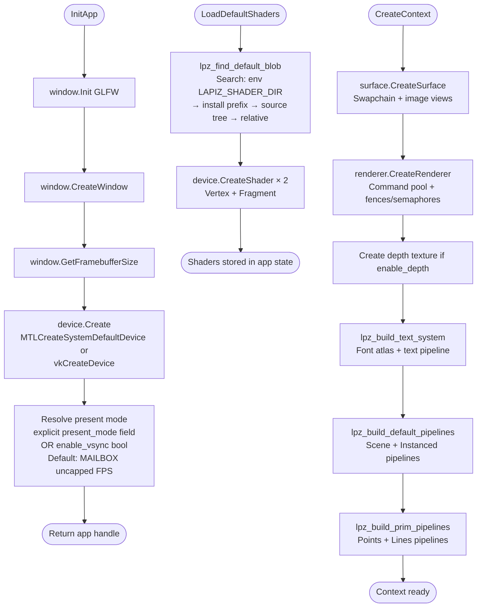

### 7.2 Main Loop

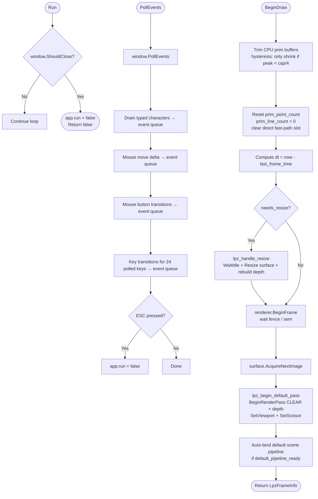

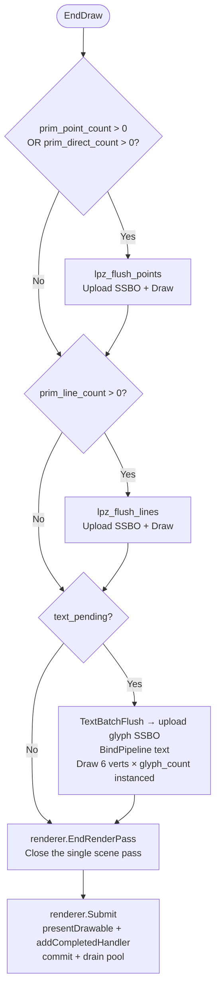

> **Key insight:** Text rendering was moved *inside* the main pass before `EndRenderPass`. Previously it opened a second pass with `LOAD_OP_LOAD`, which on TBDR GPUs (Apple Silicon) forces a full tile-memory evict and reload — the most expensive per-pass operation. Merging text into the main pass eliminates this entirely.

### 7.3 App State Summary

The `LpzAppState` struct (private to `lpz.c`) holds all implicit state. Key fields:

| Field Group | Fields | Purpose |
|---|---|---|
| **Core GPU** | `device`, `surface`, `renderer` | Main GPU objects |
| **Swapchain** | `current_swapchain_tex`, `current_frame_index` | Per-frame image |
| **Depth** | `depth_texture`, `enable_depth` | Optional depth buffer |
| **Timing** | `start_time`, `last_frame_time`, `dt`, `elapsed` | Frame delta time |
| **Primitives** | `prim_point_cpu[]`, `prim_line_cpu[]` | CPU staging arrays |
| **Prim GPU** | `point_buf`, `line_buf`, `point_bg`, `line_bg` | Ring-buffered SSBOs |
| **Prim fast path** | `prim_direct_pts`, `prim_direct_count` | Zero-copy single-call path |
| **Text** | `font`, `text_batch`, `text_pipeline`, `text_bg` | Text render system |
| **Pipelines** | `default_scene_pipeline`, `prim_point_pipeline`, `prim_line_pipeline` | Cached PSOs |
| **Grid cache** | `grid_cache[]`, `grid_cache_valid` | Line geometry for axes/grid |
| **Events** | `LpzEventQueue` (ring buffer, 256 cap) | Input event queue |

---

## 8. Explicit API — Full Pipeline Control

For advanced use, the complete GPU API is accessible via `GetAPI(app)` which returns a raw `LpzAPI*`. The caller then owns all object lifetimes.

### 8.1 Manual Render Loop

```c
LpzAPI *api = GetAPI(app);
lpz_device_t   dev      = GetDevice(app);
lpz_renderer_t renderer = GetRenderer(app);
lpz_surface_t  surface  = GetSurface(app);

// --- One-time setup ---
lpz_shader_t vs, fs;
api->device.CreateShader(dev, &vs_desc, &vs);
api->device.CreateShader(dev, &fs_desc, &fs);
api->device.CreatePipeline(dev, &pso_desc, &my_pipeline);
api->device.CreateBindGroupLayout(dev, &bgl_desc, &my_bgl);
api->device.CreateBuffer(dev, &buf_desc, &my_ubo);
api->device.CreateBindGroup(dev, &bg_desc, &my_bg);

// --- Per frame ---
while (Run(app)) {
    PollEvents(app);

    // Advance frame — waits on in-flight fence
    api->renderer.BeginFrame(renderer);
    uint32_t fi = api->renderer.GetCurrentFrameIndex(renderer);

    // Acquire swapchain image
    api->surface.AcquireNextImage(surface);
    lpz_texture_t swapTex = api->surface.GetCurrentTexture(surface);

    // Open render pass manually — full control over attachments
    LpzColorAttachment ca = {
        .texture  = swapTex,
        .load_op  = LPZ_LOAD_OP_CLEAR,
        .store_op = LPZ_STORE_OP_STORE,
        .clear_color = {0.1f, 0.1f, 0.1f, 1.0f},
    };
    LpzRenderPassDesc pass = {
        .color_attachments      = &ca,
        .color_attachment_count = 1,
    };
    api->renderer.BeginRenderPass(renderer, &pass);

    // Full state control
    api->renderer.SetViewport(renderer, 0, 0, w, h, 0, 1);
    api->renderer.BindPipeline(renderer, my_pipeline);
    api->renderer.BindBindGroup(renderer, 0, my_bg, NULL, 0);
    api->renderer.PushConstants(renderer, LPZ_SHADER_STAGE_ALL_GRAPHICS,
                                 0, sizeof(my_pc), &my_pc);
    api->renderer.DrawIndexed(renderer, index_count, 1, 0, 0, 0);

    api->renderer.EndRenderPass(renderer);
    api->renderer.Submit(renderer, surface);
}

// --- Teardown ---
api->device.WaitIdle(dev);
api->device.DestroyBindGroup(my_bg);
api->device.DestroyPipeline(my_pipeline);
// ...
```

### 8.2 Pipeline Object Lifecycle

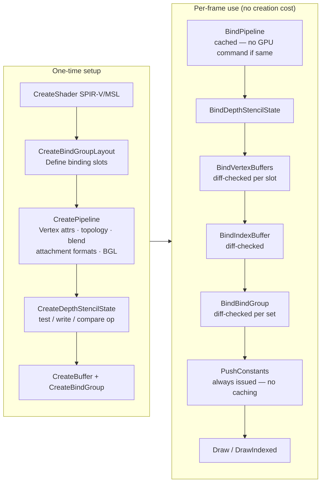

### 8.3 State Diffing — How Redundant GPU Commands Are Eliminated

Every `Bind*` and `Set*` function in the renderer checks cached state before issuing the underlying GPU command:

```c
// BindPipeline (Vulkan):
if (renderer->activePipeline == pipeline) return;  // skip
renderer->activePipeline = pipeline;
vkCmdBindPipeline(cmd, pipeline->bindPoint, pipeline->pipeline);

// SetViewport:
VkViewport vp = { x, height-y, width, -height, min_depth, max_depth };
if (renderer->viewportValid && memcmp(&renderer->cachedViewport, &vp, sizeof(vp)) == 0)
    return;  // skip
renderer->cachedViewport = vp;
renderer->viewportValid = true;
vkCmdSetViewport(cmd, 0, 1, &vp);

// BindVertexBuffers — per-slot diffing:
for (uint32_t i = 0; i < count; i++) {
    if (renderer->activeVertexBuffers[idx].buffer != buffers[i] ||
        renderer->activeVertexBuffers[idx].offset != offsets[i])
        changed = true;
}
if (!changed) return;  // skip entire bind call
```

State is reset to "unknown" at the start of every render pass (`lpz_vk_renderer_reset_state` / `lpz_renderer_reset_frame_state`), ensuring the first bind after `BeginRenderPass` always issues the GPU command correctly.

### 8.4 Transfer Pass — Mesh Upload


### 8.5 Compute Pass (Extended API)

```c
LpzAPI *api = GetAPI(app);

api->rendererExt.BeginComputePass(renderer);
// Emits a pipeline barrier: ALL_GRAPHICS+TRANSFER → COMPUTE_SHADER

api->rendererExt.BindComputePipeline(renderer, compute_pipeline);
api->renderer.BindBindGroup(renderer, 0, compute_bg, NULL, 0);
api->rendererExt.DispatchCompute(renderer,
    group_x, group_y, group_z,
    thread_x, thread_y, thread_z);

api->rendererExt.EndComputePass(renderer);
// Emits reverse barrier: COMPUTE_SHADER → ALL_GRAPHICS+TRANSFER
```

On Metal 3+, `DispatchCompute` uses `dispatchThreads:threadsPerThreadgroup:` which automatically handles partial last-threadgroup clipping. On Metal 2 it falls back to `dispatchThreadgroups:threadsPerThreadgroup:`, requiring the caller to round up counts.

### 8.6 Explicit Text Renderer

The advanced text path separates atlas management, batch management, and rendering into independent objects:

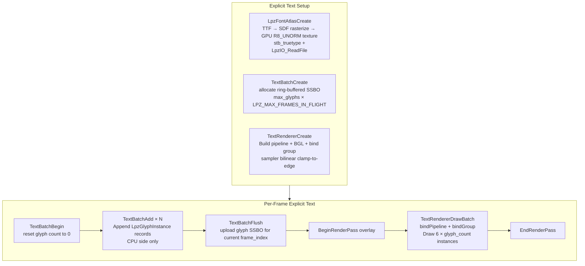

---

## 9. Primitive Drawing System

### 9.1 Point & Line Batching

All `DrawPoint`, `DrawPointCloud`, `DrawLine`, and `DrawLineSegments` calls accumulate into CPU arrays during the frame. A single GPU upload + draw is issued per type at `EndDraw` — this eliminates the SSBO overwrite problem that occurred when multiple calls shared the same ring-buffer slot in a single frame.

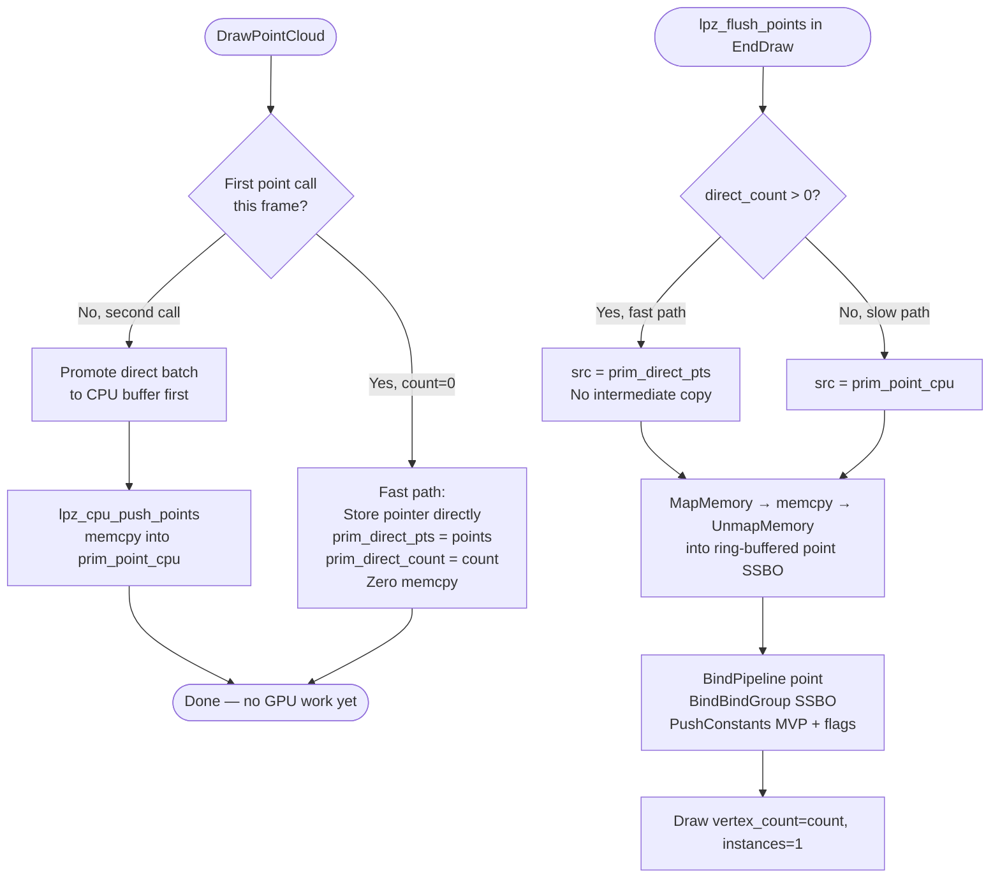

### 9.2 GPU Buffer Growth Strategy

Point and line SSBOs use **power-of-two growth with a high-watermark trim heuristic**. The buffer never shrinks below `MIN_CAP = 256` and only grows when the current peak exceeds capacity:

```c
// Growth (lpz_prim_ensure_gpu_buf):
uint32_t cap = need_count > 1u
    ? 1u << (32u - (uint32_t)__builtin_clz(need_count - 1u))  // next power of 2
    : 1u;
if (cap < 64u) cap = 64u;

// Trim (BeginDraw — only when both current cap >> floor AND peak << cap):
if (prim_point_peak < prim_point_cap_cpu / SHRINK_FACTOR) {
    uint32_t new_cap = MAX(MIN_CAP, prim_point_peak * 2u);
    realloc(prim_point_cpu, new_cap * sizeof(LpzPoint));
}
```

This prevents the pathological oscillation where a 1M-point workload would cause `trim(32MB → 8MB)` then `grow(8MB → 32MB)` on alternate frames.

### 9.3 Grid/Axes Caching

`DrawGridAndAxes` rebuilds the line geometry only when parameters change (grid size, axis size, thickness, or flags). The rebuilt geometry is stored in `grid_cache[]` and reused every frame until invalidation:

```c
bool rebuild = !app->grid_cache_valid
    || app->grid_cache_grid_size != grid_size
    || app->grid_cache_axis_size != axis_size
    || app->grid_cache_thickness != thickness
    || app->grid_cache_flags != (uint32_t)flags;
```

On stable parameters, `DrawGridAndAxes` costs only a single `lpz_cpu_push_lines` (a `memcpy` of the cached geometry).

---

## 10. Text Rendering System

### 10.1 SDF Atlas Generation

The font atlas uses **Signed Distance Field** rasterization via `stb_truetype`. The resulting R8_UNORM texture encodes the distance to the nearest glyph edge at each pixel:

| Value | Meaning |
|---|---|
| `> 0.5` | Inside the glyph |
| `= 0.5` | Exactly on the edge |
| `< 0.5` | Outside (background) |
| `< 0.01` | Far outside — early `discard` |

### 10.2 Fragment Shader Anti-Aliasing

```glsl
// text.frag — SDF with fwidth-based AA:
float sdf   = texture(sampler2D(u_atlas, u_sampler), v_uv).r;
if (sdf < 0.01) discard;                  // early-out: far outside glyph

float w     = fwidth(sdf);                // screen-space derivative
float alpha = smoothstep(0.5-w, 0.5+w, sdf);  // AA band = ±1 pixel

if (alpha < 0.004) discard;               // discard SDF ringing artefacts
out_color = vec4(v_color.rgb, v_color.a * alpha);
```

`fwidth(sdf)` returns `abs(dFdx(sdf)) + abs(dFdy(sdf))` — automatically scaling the AA band to the screen-space texel size, giving correct antialiasing at any text scale, rotation, or perspective projection.

### 10.3 Glyph Instance Layout

Each glyph is a `LpzGlyphInstance` (64 bytes, 16 × float) uploaded to the ring-buffered SSBO:

```
offset  0: pos_x, pos_y         — screen-space top-left (pixels)
offset  8: size_x, size_y       — quad size (pixels)
offset 16: uv_x, uv_y           — atlas UV origin [0,1]
offset 24: uv_w, uv_h           — atlas UV extent [0,1]
offset 32: r, g, b, a           — linear RGBA color
offset 48: screen_w, screen_h   — framebuffer dimensions for NDC
offset 56: font_size, _pad      — em-size in pixels + padding to 64 bytes
```

The vertex shader reads this SSBO indexed by `gl_InstanceIndex`, generates all 6 corners of the glyph quad procedurally (no vertex buffer), and converts screen-space coordinates to NDC using a single FMA:

```glsl
// text.vert — NDC conversion with Y-flip baked in:
vec2 ndc = fma(screen_pos, vec2(2.0, -2.0) / g.screen, vec2(-1.0, 1.0));
//         ↑ single fused multiply-add replaces: div + mul + sub + negate
```

---

## 11. Resource Management & Lifecycle

### 11.1 Full Lifecycle Diagram

```mermaid
flowchart TD
    IA([InitApp]) --> |Creates| W[Window\nlpz_window_t]
    IA --> |Creates| D[Device\nlpz_device_t]

    CC([CreateContext]) --> |Creates| S[Surface\nlpz_surface_t]
    CC --> |Creates| R[Renderer\nlpz_renderer_t]
    CC --> |Creates| DT[Depth Texture\nlpz_texture_t]
    CC --> |Creates| PP[Pipelines ×4\nlpz_pipeline_t]
    CC --> |Creates| BUF[GPU Buffers\npoint/line/inst SSBOs]
    CC --> |Creates| FA[Font Atlas\nLpzFontAtlas]
    CC --> |Creates| TB[Text Batch\nTextBatch]

    ML["Main Loop\nRun / BeginDraw / EndDraw"] --> |Uses| R
    ML --> |Uses| S
    ML --> |Uses| BUF

    DC([DestroyContext]) --> |Destroys in order| BUF2[GPU Buffers\npoint/line/inst/text]
    DC --> |Destroys| PP2[Pipelines + DS states + BGLs]
    DC --> |Destroys| TB2[TextBatch + FontAtlas]
    DC --> |Destroys| DT2[Depth Texture]
    DC --> |Destroys| R2[Renderer]
    DC --> |Destroys| S2[Surface]

    CLA([CleanUpApp]) --> |Calls| DC
    CLA --> |Destroys| D2[Device\npipeline_cache_save to disk]
    CLA --> |Destroys| W2[Window]
    CLA --> |Frees| AS[LpzAppState heap]
```

### 11.2 Object Ownership Rules

| Object | Owner | When to Destroy |
|---|---|---|
| `lpz_device_t` | App / `CleanUpApp` | After all other GPU objects |
| `lpz_surface_t` | `CreateContext` / `DestroyContext` | Before device |
| `lpz_renderer_t` | `CreateContext` / `DestroyContext` | Before device, after surface |
| `lpz_pipeline_t` | Caller | Anytime after `WaitIdle` |
| `lpz_buffer_t` | Caller | Anytime after `WaitIdle` |
| `lpz_texture_t` | Caller | Anytime after `WaitIdle` |
| `lpz_bind_group_t` | Caller | Anytime after `WaitIdle` |
| `Mesh.vb / Mesh.ib` | Caller via `DestroyMesh` | Anytime after `WaitIdle` |

### 11.3 Synchronization Summary

| Mechanism | Used For | Backend |
|---|---|---|
| `dispatch_semaphore` / POSIX `sem_t` | Frame-in-flight CPU pacing | Metal |
| `VkFence` (pre-signaled) | Frame-in-flight CPU pacing | Vulkan |
| `VkSemaphore` (imageAvailable) | Swapchain acquire → render sync | Vulkan |
| `VkSemaphore` (renderFinished) | Render → present sync | Vulkan |
| `vkDeviceWaitIdle` | Resize operations only | Vulkan |
| `_Atomic uint32_t` | Draw counter (stats only, no ordering) | Both |
| `@autoreleasepool` | ObjC teardown outside active pool | Metal |
| Deferred free queue | GPU object lifetime with retainedReferences=NO | Metal |

---

## 12. Backend Comparison Reference

### Feature Parity Table

| Feature | Metal | Vulkan |
|---|---|---|
| Dynamic rendering (no render pass objects) | Native — `MTLRenderCommandEncoder` | `VK_KHR_dynamic_rendering` (1.3 core) |
| Pipeline caching | `MTLBinaryArchive` (Metal 3+) | `VkPipelineCache` (always, disk-persisted) |
| Command buffer pre-allocation | Reused descriptor (`cbDesc`) | Pre-allocated per-frame `VkCommandBuffer[3]` |
| Mesh shaders | `drawMeshThreadgroups:` (Metal 3+, Apple7+) | `VK_EXT_mesh_shader` |
| Argument tables / descriptor buffers | `MTL4ArgumentTable` (Metal 4+) | `VK_EXT_descriptor_buffer` |
| Residency hints | `MTLResidencySet` (Metal 4+) | N/A |
| Sync2 barriers | Automatic hazard tracking | `VK_KHR_synchronization2` / 1.3 core |
| Transfer queue | Graphics queue (Metal only has one) | Dedicated DMA queue when available |
| GPU timeline | `MTLSharedEvent` | `VkFence` + `VkSemaphore` |
| Image layout tracking | N/A (automatic) | Per-texture `currentLayout` + `layoutKnown` |
| Frame arena size | 64 KB (`LPZ_MTL_FRAME_ARENA_SIZE`) | 64 KB (`LPZ_VK_FRAME_ARENA_SIZE`) |
| Atomic draw counter | `_Atomic uint32_t`, relaxed | `_Atomic uint32_t`, relaxed |
| Present modes | FIFO / non-FIFO via `displaySyncEnabled` | FIFO / MAILBOX / IMMEDIATE (with fallback) |

### Per-Frame Cost Comparison

| Operation | Metal | Vulkan |
|---|---|---|
| Frame synchronization | `dispatch_semaphore_wait` | `vkWaitForFences` |
| Arena reset | `arenaOffset = 0` (1 store) | `arenaOffset = 0` (1 store) |
| Command buffer begin | `commandBufferWithDescriptor:` (reused desc) | `vkResetCommandBuffer` + `vkBeginCommandBuffer` |
| Render pass begin | `renderCommandEncoderWithDescriptor:` | `vkCmdBeginRenderingKHR` |
| State reset after pass | `lpz_renderer_reset_frame_state` | `lpz_vk_renderer_reset_state` |
| Submit | `commit` + `addCompletedHandler` | `vkQueueSubmit` |
| Present | `presentDrawable:` (inside commit) | `vkQueuePresentKHR` |
| Pool teardown | `NSAutoreleasePool drain` | N/A |

### Vulkan Barrier Strategy

Lapiz uses `VK_KHR_synchronization2` (Vulkan 1.3 core) when available, falling back to the legacy `vkCmdPipelineBarrier`. The choice is made once at device creation and dispatched through the `lpz_vk_image_barrier` inline helper:

```mermaid
flowchart LR
    IB[lpz_vk_image_barrier called] --> S2{g_has_sync2\nAND g_vkCmdPipelineBarrier2\nnot NULL?}
    S2 -- Yes --> SB[VkImageMemoryBarrier2KHR\nsrcStageMask2 / dstStageMask2\nvkCmdPipelineBarrier2KHR]
    S2 -- No --> LB[VkImageMemoryBarrier\nsrcStageMask / dstStageMask\nvkCmdPipelineBarrier legacy]
```

Sync2 allows more precise stage masks (e.g. `VK_PIPELINE_STAGE_2_BLIT_BIT_KHR`) and is required for correct mipmap generation on Vulkan 1.3 drivers.