# Lapiz
A cross-platform C graphics library built on top of Metal and Vulkan.

---

## About

Lapiz is a personal project I built because I wanted a single graphics library I could reach for across my own projects without being locked into one API or platform. I've been writing Metal code for about three years, so that backend came naturally — Vulkan was the real challenge. I used AI to help clarify concepts, work through the synchronization model, and debug behaviour that was hard to reason about without a second perspective. The architecture, decisions, and all the actual code are my own; the AI was a sounding board and documentation aid, not a code generator.

The name *Lapiz* is Spanish for *pencil* — a tool you pick up and draw with, without thinking about how it works.

---

## Features

- **Dual-backend rendering** — Metal on Apple platforms, Vulkan everywhere else (including MoltenVK on macOS). The same application code runs on both without any `#ifdef` in user code.
- **Easy API** — `InitApp` → `CreateContext` → `BeginDraw` / `EndDraw` loop. The library manages the swapchain, depth buffer, frame pacing, and pipeline binding automatically.
- **Explicit API** — full access to every GPU object (`device.*`, `renderer.*`, `surface.*`) for when you need complete control over attachments, push constants, or custom pipeline state.
- **3D mesh rendering** — upload indexed geometry with `UploadMesh`, draw with `DrawMesh` or `DrawMeshInstanced`. Built-in Blinn-Phong lighting with instanced transform SSBOs.
- **Primitive drawing** — `DrawPoint`, `DrawPointCloud`, `DrawLine`, `DrawLineSegments` with additive blending for points and alpha-blended screen-space quads for lines. Handles 1M+ points per frame.
- **Grid and axes** — `DrawGrid` with three composable modes: bounded XZ line grid, short axis arrows, and a shader-based infinite grid that fades at the horizon.
- **SDF text rendering** — `DrawText` / `DrawTextFmt` backed by a stb_truetype SDF atlas. Anti-aliased at any scale via `fwidth()`. Kern table and advance cache built at atlas creation time.
- **Custom shaders** — `LoadShaders` compiles Metal source or SPIR-V at runtime. Full pipeline override hooks (`LpzPipelineOverrides`) let you replace the built-in scene, text, or depth state.
- **Texture loading** — `LoadTexture` reads PNG/JPEG/BMP via stb_image and uploads to GPU.
- **Geometry generation** — `GenerateSphere`, `GenerateCylinder`, `GenerateTorus`, `GenerateCone`, `GeneratePlane`, `GeneratePolygon`, `GeneratePrism`, plus built-in `TRIANGLE_VERTICES`, `QUAD_VERTICES`, and `CUBE_VERTICES` constants.
- **Compute** — explicit compute pass via `rendererExt.BeginComputePass` / `DispatchCompute`, with Metal 3 `dispatchThreads:` support.
- **Event system** — typed input events (keyboard, mouse buttons, mouse move, character input) via a 256-capacity ring buffer.
- **Triple-buffering** — ring-buffered SSBOs and persistent GPU memory mapping eliminate per-frame driver overhead.

---

## Lapiz 1.0.0

- [x] Render using Metal and Vulkan
- [x] Render 2D and 3D
- [x] Render text
- [x] Custom shaders
- [x] Explicit and implicit implementations
- [ ] Windows support (Vulkan path compiles; window backend untested)
- [ ] Render bundles (ICB on Metal, secondary command buffers on Vulkan)
- [x] MSAA
- [ ] glTF scene loading

---

## Table of Contents

1. [System Overview](#1-system-overview)
2. [API Layers](#2-api-layers)
3. [Vulkan Backend](#3-vulkan-backend)
4. [Metal Backend](#4-metal-backend)
5. [Triple-Buffering & Frame Pacing](#5-triple-buffering--frame-pacing)
6. [C11 Performance Features](#6-c11-performance-features)
7. [Easy API — Implicit Path](#7-easy-api--implicit-path)
8. [Explicit API — Full Pipeline Control](#8-explicit-api--full-pipeline-control)
9. [Primitive Drawing System](#9-primitive-drawing-system)
10. [Text Rendering System](#10-text-rendering-system)
11. [Resource Management & Lifecycle](#11-resource-management--lifecycle)
12. [Backend Comparison Reference](#12-backend-comparison-reference)

---

## 1. System Overview

Lapiz is a cross-platform rendering library built on top of Vulkan and Apple Metal. It exposes **two distinct usage modes**: a high-level *easy API* that manages the entire render loop implicitly, and a low-level *explicit API* that gives the caller full control over every GPU object. Internally, both modes share the same backend infrastructure.

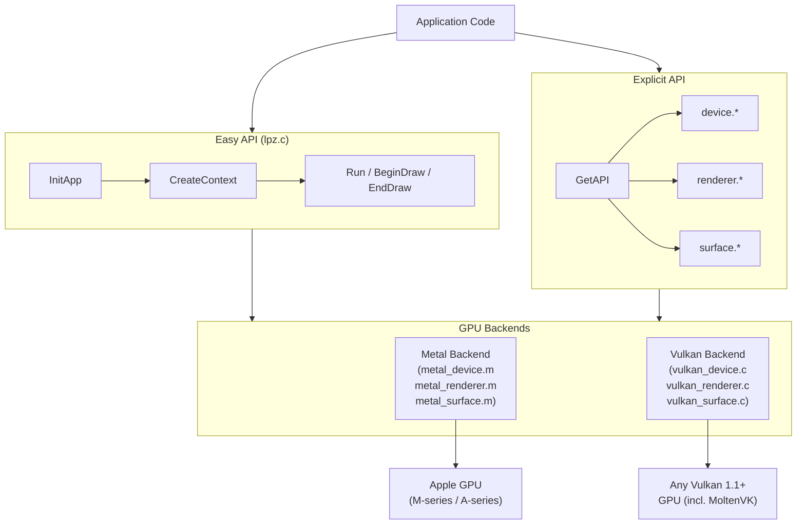

### Key Design Principles

| Principle | Implementation |
|---|---|
| **Zero-allocation hot path** | Frame arena bump allocator; stack buffers for transient queries |
| **State diffing** | Cached pipeline / viewport / scissor / MVP hash — GPU command only on change |
| **Triple-buffering** | `LPZ_MAX_FRAMES_IN_FLIGHT = 3` ring buffers for all dynamic data |
| **Persistent SSBO mapping** | GPU write-combine memory mapped once per slot, reused every frame |
| **Atomic counters** | `_Atomic uint32_t` draw counter reset per frame, no mutex |
| **Backend parity** | Both backends implement identical `LpzRendererAPI` function tables |
| **Deferred destruction** | GPU objects queued for release only after their frame slot retires |
| **Macro hygiene** | `LPZ_FREE`, `LPZ_MAX`, `LPZ_MIN`, `LAPIZ_UNLIKELY` from `internals.h` — no local re-definitions |

---

## 2. API Layers

The entire public surface is stored in a single `LpzAPI` struct that is populated at `InitApp` time. Every backend function is reached through a function pointer in this table — there are no virtual functions, no vtables, and no runtime dispatch overhead beyond a single pointer dereference.

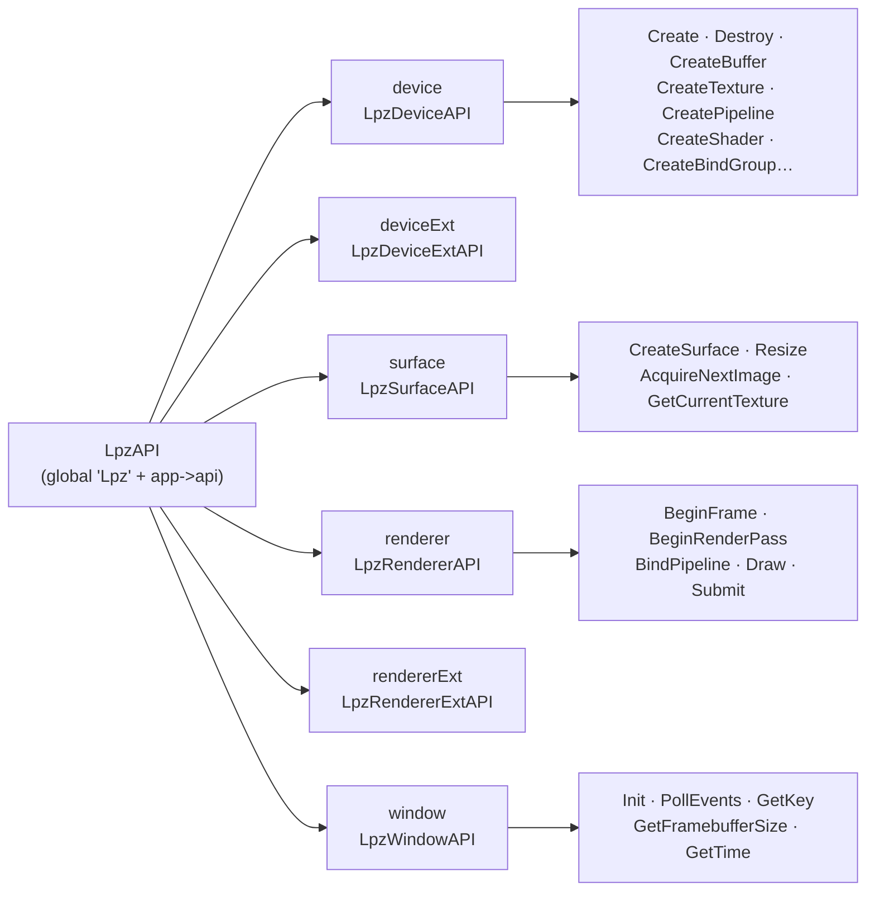

The macro `LPZ_MAKE_API_METAL()` / `LPZ_MAKE_API_VULKAN()` fills this table at compile-time with the correct backend's static function pointers. No heap allocation is involved; the table is a plain C struct copied by value during `InitApp`.

---

## 3. Vulkan Backend

### 3.1 Device Creation Sequence

Device creation in `vulkan_device.c` follows a strict ordered sequence of probes and capability negotiations:


#### Queue Family Strategy

Lapiz discovers three queue families and falls back gracefully:

| Queue | Selection Rule | Fallback |
|---|---|---|
| **Graphics** | First family with `VK_QUEUE_GRAPHICS_BIT` | Error (required) |
| **Transfer** | Transfer-only family (no GRAPHICS bit) | Graphics family |
| **Compute** | Compute-only family (no GRAPHICS bit) | Graphics family |

This allows async DMA uploads on discrete GPUs (which have dedicated DMA engines) while working transparently on integrated and Apple Silicon devices.

### 3.2 Extension Feature Flags

All optional features are stored as **module-level `bool` globals** in `vulkan_device.c` and declared `extern` in `vulkan_internal.h`. This lets every translation unit read the flags without passing context pointers through every call:

```c
extern bool g_vk13;                    // Vulkan 1.3 core features (sync2, dynRender)
extern bool g_has_sync2;               // VK_KHR_synchronization2
extern bool g_has_dynamic_render;      // vkCmdBeginRenderingKHR
extern bool g_has_ext_dyn_state;       // dynamic depth/stencil state
extern bool g_has_mesh_shader;         // VK_EXT_mesh_shader
extern bool g_has_draw_indirect_count;
extern float g_timestamp_period;
```

The corresponding function pointers are loaded with `vkGetDeviceProcAddr` once at device create time and stored alongside the flags:

```c
PFN_vkCmdBeginRenderingKHR    g_vkCmdBeginRendering   = NULL;
PFN_vkCmdPipelineBarrier2KHR  g_vkCmdPipelineBarrier2 = NULL;
```

### 3.3 Swapchain & Surface

The surface layer (`vulkan_surface.c`) negotiates all parameters at creation time and persists them across resizes:

```mermaid
flowchart TD
    SC([lpz_vk_surface_create]) --> VK[Lpz.window.CreateVulkanSurface\n→ VkSurfaceKHR]
    VK --> FMT[Query surface formats\nstack buffer ≤32, heap fallback]
    FMT --> NEG{Preferred format\nRGB10A2 / RGBA16F / BGRA8}
    NEG -- HDR10 → A2B10G10R10 + ST2084
    NEG -- scRGB → R16G16B16A16 + EXTENDED_SRGB_LINEAR
    NEG -- SDR → B8G8R8A8_UNORM + SRGB_NONLINEAR
    FMT --> PM[select_present_mode\nMAILBOX → IMMEDIATE → FIFO]
    PM --> SW[vkCreateSwapchainKHR\nminImageCount = LPZ_MAX_FRAMES_IN_FLIGHT]
    SW --> IV[Build swapchain image views\ntexture_t per image with layout tracking]
    IV --> SEM[Create N semaphore pairs\nimageAvailable · renderFinished]
    SEM --> RET([Return lpz_surface_t])
```

#### Present Mode Fallback Chain

On MoltenVK (macOS), `VK_PRESENT_MODE_MAILBOX_KHR` is not supported. The two-pass search in `select_present_mode` avoids silently capping FPS:

```
Requested: MAILBOX
  Pass 1: search for MAILBOX     → not found
  Pass 2: foundSecondary (IMMEDIATE) → selected = IMMEDIATE
  → Log warning: "Requested present mode unavailable; using fallback (2 → 0)"

Requested: FIFO → return immediately (always available, no search needed)
```

#### Image Layout Tracking

Every `struct texture_t` carries two layout fields:

```c
VkImageLayout currentLayout;  // last-known layout
bool          layoutKnown;    // false until first barrier is issued
```

Before every render pass attachment, `lpz_vk_transition_tracked_texture` issues a precisely-scoped barrier using `currentLayout` as `oldLayout` instead of always specifying `VK_IMAGE_LAYOUT_UNDEFINED`. This avoids redundant driver transitions and prevents content loss on LOAD operations.

### 3.4 Render Pass (Dynamic Rendering)

Lapiz uses `VK_KHR_dynamic_rendering` (core in Vulkan 1.3) rather than render-pass objects. There are no `VkRenderPass` or `VkFramebuffer` handles anywhere in the codebase:

```mermaid
flowchart LR
    BP([BeginRenderPass]) --> TR[Transition all color attachments\nto COLOR_ATTACHMENT_OPTIMAL]
    TR --> TD[Transition depth attachment\nto DEPTH_STENCIL_ATTACHMENT_OPTIMAL]
    TD --> BI[Build VkRenderingAttachmentInfo array\nfrom frame arena — O(1) alloc]
    BI --> BR[vkCmdBeginRenderingKHR\nVkRenderingInfo]
    BR --> RS[lpz_vk_renderer_reset_state\nClear active pipeline / bind groups\nviewportValid = scissorValid = false]
    RS --> Draw["Draw calls…"]
    Draw --> ER[vkCmdEndRenderingKHR]
```

### 3.5 Submit & Frame Advance

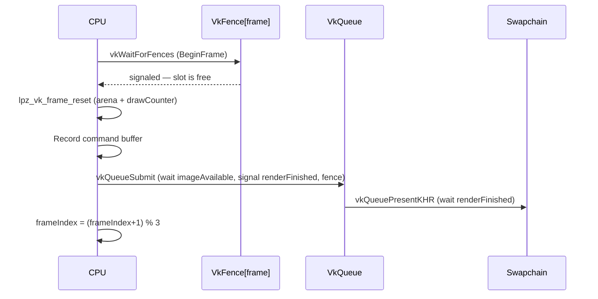

---

## 4. Metal Backend

### 4.1 Device Creation Sequence


#### Metal Version Feature Tiers

The `LAPIZ_MTL_VERSION_MAJOR` macro is derived from `__MAC_OS_X_VERSION_MIN_REQUIRED` at compile time:

| Deployment Target | Metal Version | Features Unlocked |
|---|---|---|
| macOS 10.14+ | Metal 2 | Base feature set |
| macOS 13+ | Metal 3 | `MTLBinaryArchive` (pipeline cache), `MTLIOCommandQueue`, `dispatchThreads:` |
| macOS 26+ | Metal 4 | `MTLResidencySet`, `MTL4ArgumentTable`, argument buffers v3 |

### 4.2 Pipeline Cache (Metal 3)

Metal 3 provides `MTLBinaryArchive` for cross-launch pipeline caching. The cache helpers in `metal_internal.h` own the full lifecycle with careful autorelease pool management (required because teardown happens outside any active pool):

```mermaid
flowchart LR
    subgraph Create ["lpz_mtl3_create_pipeline_cache"]
        direction TB
        A1[@autoreleasepool] --> A2[lpz_mtl3_pipeline_cache_url\nretained NSURL]
        A2 --> A3{File exists?}
        A3 -- Yes --> A4[newBinaryArchiveWithDescriptor url:]
        A3 -- No --> A5[newBinaryArchiveWithDescriptor nil]
        A4 --> A6{Load ok?}
        A6 -- Fail --> A7[Delete stale file\nretry with nil url]
        A6 -- Ok --> A8[return archive]
        A7 --> A8
        A5 --> A8
        A2 --> A9[cacheURL release]
    end

    subgraph Flush ["lpz_mtl3_flush_pipeline_cache"]
        direction TB
        B1[@autoreleasepool] --> B2[lpz_mtl3_pipeline_cache_url\nretained NSURL]
        B2 --> B3[serializeToURL:error:]
        B3 --> B4{Error?}
        B4 -- Yes --> B5[removeItemAtURL\nDelete stale cache]
        B4 -- No --> B6[Done]
        B2 --> B7[url release]
    end
```

> **Why `@autoreleasepool` is mandatory here:** `lpz_mtl3_flush_pipeline_cache` is called from `lpz_device_destroy` → `CleanUpApp`, which is pure C teardown with no active pool. Without an explicit pool, all autoreleased ObjC objects (including Metal's internal objects inside `serializeToURL:`) are registered to the thread's root pool — which is already drained at that point. This is the root cause of the `EXC_BAD_ACCESS` crash inside `objc_retain` seen in `_MTLBinaryArchive`.

### 4.3 Renderer & Command Encoding

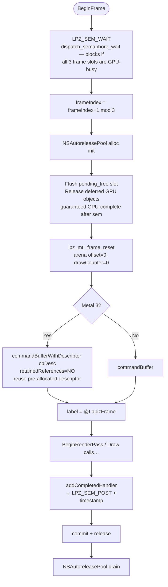

#### `retainedReferences=NO` and Deferred Destruction

When `MTLCommandBufferDescriptor.retainedReferences = NO`, Metal will **not** retain any resources referenced in the command buffer. This eliminates per-resource retain/release overhead in the hot path. The tradeoff is that the application must guarantee resource lifetime manually.

Lapiz handles this with a **deferred destruction queue** embedded in `struct renderer_t`:

```c
id<NSObject> pending_free[LPZ_MAX_FRAMES_IN_FLIGHT][LPZ_MTL_MAX_DEFERRED_FREE];
uint32_t     pending_free_count[LPZ_MAX_FRAMES_IN_FLIGHT];
```

Objects enqueued here are released at the **next `BeginFrame` that reuses the same slot** — which is guaranteed to be after the GPU has signaled the semaphore for that slot, making it safe to release.

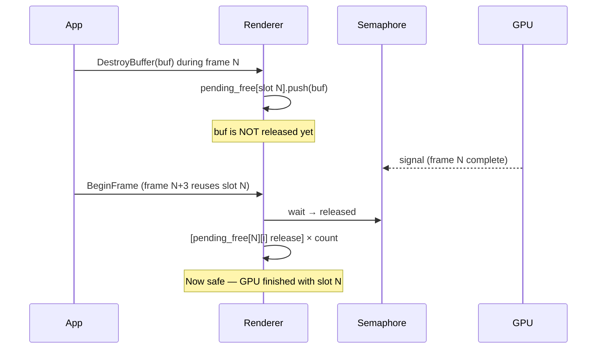

### 4.4 Normal Transform Optimization

The vertex shader `vertex_scene` transforms surface normals using an explicit `float3x3` extraction instead of a 4×4 multiply:

```metal
// Explicit 3x3 — 9 muls + 6 adds vs 12 muls + 8 adds:
out.normal_world = float3x3(model[0].xyz, model[1].xyz, model[2].xyz) * in.normal;
```

---

## 5. Triple-Buffering & Frame Pacing

Both backends use **3 frame slots** (`LPZ_MAX_FRAMES_IN_FLIGHT = 3`) to allow the CPU to record frame N+1 while the GPU executes frame N.

```mermaid
gantt
    title Frame Pipelining (3 in-flight slots)
    dateFormat X
    axisFormat %s

    section CPU
    Record Frame 0      :a1, 0, 2
    Record Frame 1      :a2, 2, 4
    Record Frame 2      :a3, 4, 6
    Wait (slot 0 busy)  :crit, a4, 6, 7
    Record Frame 3      :a5, 7, 9

    section GPU
    Execute Frame 0     :b1, 2, 5
    Execute Frame 1     :b2, 5, 8
    Execute Frame 2     :b3, 8, 11
```

### Ring-Buffered Resources

Any resource that is written by the CPU and read by the GPU in the same frame must be ring-buffered. Lapiz marks buffers as ring-buffered at creation time:

```c
LpzBufferDesc bd = {
    .size = per_frame_size * LPZ_MAX_FRAMES_IN_FLIGHT,
    .ring_buffered = true,  // signals that size includes all slots
    .memory_usage = LPZ_MEMORY_USAGE_CPU_TO_GPU,
};
```

At bind time, the correct slot is selected:

```c
// Metal:
NSUInteger slot = buf->isRing ? (frameIndex % LPZ_MAX_FRAMES_IN_FLIGHT) : 0;
return buf->buffers[slot];

// Vulkan:
VkBuffer vk_buf = buffer->isRing ? buffer->buffers[renderer->frameIndex] : buffer->buffers[0];
```

### Resources That Are Ring-Buffered

| Resource | Why |
|---|---|
| Primitive SSBO (points, lines) | Written by CPU every frame with new draw data |
| Instance SSBO (DrawMeshInstanced) | Per-frame transform + color data |
| Text glyph SSBO | Rebuilt each frame from TextBatchAdd calls |
| Transient upload ring (Metal) | Sub-allocated within `lpz_renderer_alloc_transient_bytes` |

### Persistent SSBO Mapping

All three dynamic SSBOs (point, line, instance) are **mapped once per in-flight slot** and the pointer is reused every frame. This eliminates one `MapMemory` + one `UnmapMemory` driver call per flush per frame — the equivalent of the text batch's persistent mapping strategy, now applied uniformly:

```c
// First access for this slot — map and cache:
if (LAPIZ_UNLIKELY(!app->inst_map_valid[inst_slot])) {
    app->inst_mapped_ptrs[inst_slot] =
        app->api.device.MapMemory(app->device, app->inst_buf, inst_slot);
    app->inst_map_valid[inst_slot] = (app->inst_mapped_ptrs[inst_slot] != NULL);
}
void *m = app->inst_mapped_ptrs[inst_slot];
if (m) memcpy(m, instance_data, bytes);
// No UnmapMemory — pointer stays valid until the buffer is destroyed or grown.
```

When the backing buffer is destroyed and recreated (capacity growth), all `*_map_valid` flags are cleared with `memset(..., 0, ...)` so the next access re-maps from the new allocation. `DestroyContext` calls `UnmapMemory` for every live slot before `DestroyBuffer`.

---

## 6. C11 Performance Features

### 6.1 `internals.h` — Shared Macro Infrastructure

All performance-sensitive macros are defined once in `internals.h` and included by every translation unit that needs them. This eliminates local re-definitions and guarantees consistent behaviour across the codebase:

```c
// Safe free-and-null in one step:
#define LPZ_FREE(x)   do { free((void *)(x)); (x) = NULL; } while (0)

// Min / max without type-unsafe system macros:
#define LPZ_MAX(a, b) ((a) > (b) ? (a) : (b))
#define LPZ_MIN(a, b) ((a) < (b) ? (a) : (b))

// Branch prediction hints (expand to __builtin_expect on GCC/Clang):
#define LAPIZ_LIKELY(x)   __builtin_expect(!!(x), 1)
#define LAPIZ_UNLIKELY(x) __builtin_expect(!!(x), 0)

// Alignment:
#define LAPIZ_ALIGN(X) __attribute__((aligned(X)))  // GCC/Clang
```

`lpz.c` no longer defines a local `MAX` — it uses `LPZ_MAX` from `internals.h` exclusively. All `__builtin_expect` calls in the hot path have been replaced with `LAPIZ_UNLIKELY`.

### 6.2 Frame Arena (Bump Allocator)

Both backends embed a **64 KB frame-lifetime bump allocator** directly inside `struct renderer_t`. This eliminates all heap allocations in the per-frame hot path. The capacity is defined as `LPZ_FRAME_ARENA_SIZE` in `internals.h` and shared by both backends.

```
struct renderer_t memory layout:
┌────────────────────────────────────────────────┐
│  ... other fields ...                          │
├────────────────────────────────────────────────┤
│  _Alignas(16) char frameArena[65536]           │  ← 64 KB inline
├────────────────────────────────────────────────┤
│  size_t frameArenaOffset                       │  ← bump pointer
├────────────────────────────────────────────────┤
│  _Atomic uint32_t drawCounter                  │
└────────────────────────────────────────────────┘
```

**Allocation** — `O(1)` pointer arithmetic with 16-byte alignment:

```c
LAPIZ_INLINE void *lpz_vk_frame_alloc(struct renderer_t *r, size_t size) {
    size_t aligned = (size + 15u) & ~15u;
    if (r->frameArenaOffset + aligned > LPZ_FRAME_ARENA_SIZE)
        return NULL;  // exhausted → caller uses malloc
    void *p = r->frameArena + r->frameArenaOffset;
    r->frameArenaOffset += aligned;
    return p;
}
```

**Reset** — `O(1)` single store at `BeginFrame`:

```c
LAPIZ_INLINE void lpz_vk_frame_reset(struct renderer_t *r) {
    r->frameArenaOffset = 0;   // reclaim entire 64 KB in one store
    atomic_store_explicit(&r->drawCounter, 0, memory_order_relaxed);
}
```

**What uses the arena:**

| Allocation | Before | After |
|---|---|---|
| `VkRenderingAttachmentInfo colorAtts[]` | `calloc` + `free` | `lpz_vk_frame_alloc` |
| `VkCommandBuffer vkCmds[]` in `SubmitCommandBuffers` | `malloc` + `free` | `lpz_vk_frame_alloc` |

### 6.3 C11 Atomics — `_Atomic uint32_t drawCounter`

The draw counter uses `memory_order_relaxed` — the weakest memory order, guaranteeing no lost increments without any barrier or fence. On ARM this compiles to `LDADD`; on x86 to `LOCK XADD`.

```c
atomic_fetch_add_explicit(&renderer->drawCounter, 1, memory_order_relaxed);  // in Draw
atomic_store_explicit(&renderer->drawCounter, 0, memory_order_relaxed);       // in BeginFrame
```

`memory_order_relaxed` is correct here because the counter is read only at profiling time after the frame completes, not used to synchronize any shared state.

### 6.4 `_Alignas(16)` — SIMD-Safe Alignment

The frame arena and the `prim_mvp` matrix are both declared `_Alignas(16)` / `LAPIZ_ALIGN(16)`, ensuring every arena allocation is 16-byte aligned and the MVP matrix is safe for SIMD load/store instructions on both ARM (NEON) and x86 (SSE).

### 6.5 `_Thread_local` — Per-Thread Arenas (Prepared)

`internals.h` defines `LAPIZ_THREAD_LOCAL` as `_Thread_local` on C11. The infrastructure is in place for thread-local allocators when multi-threaded command recording is added — each thread would get its own bump pointer with no synchronization overhead.

### 6.6 `_Static_assert` — Compile-Time Layout Verification

Critical struct layouts that must match the GPU shader are verified at compile time:

```c
// geometry.h:
_Static_assert(sizeof(Vertex) == 48, "Vertex must be 48 bytes");
_Static_assert(offsetof(Vertex, normal) == 12, "normal at offset 12");
_Static_assert(offsetof(Vertex, uv) == 24, "uv at offset 24");
_Static_assert(offsetof(Vertex, color) == 32, "color at offset 32");

// lpz.c:
_Static_assert(sizeof(LpzPrimPC) == 80,
    "LpzPrimPC must be exactly 80 bytes to match the GPU push-constant range");
_Static_assert(sizeof(/*infinite grid PC*/) == 80,
    "infinite grid push-constant must be 80 bytes");
```

### 6.7 `LAPIZ_UNLIKELY` — Branch Prediction Hints

All slow-path conditions in the hot path use `LAPIZ_UNLIKELY` (which expands to `__builtin_expect(..., 0)` on GCC/Clang):

```c
// Slow path: CPU staging buffer needs to grow (rare — only on first frame or after spike)
if (LAPIZ_UNLIKELY(need > app->prim_point_cap_cpu)) { /* realloc */ }

// Slow path: GPU SSBO needs to grow or bind group is missing
if (LAPIZ_UNLIKELY(!app->point_buf || app->point_buf_cap < gpu_need)) { /* grow */ }

// Slow path: persistent map not yet established for this slot
if (LAPIZ_UNLIKELY(!app->inst_map_valid[inst_slot])) { /* MapMemory + cache */ }

// Slow path: trim over-allocated CPU buffers (peak < cap/4)
if (LAPIZ_UNLIKELY(app->prim_point_cap_cpu > MIN_CAP)) { /* maybe shrink */ }
```

The `LAPIZ_LIKELY` / `LAPIZ_UNLIKELY` pair replaces direct `__builtin_expect` calls throughout, keeping the code portable (the macros degrade to no-ops on MSVC).

### 6.8 `LAPIZ_INLINE` — Forced Inlining for Hot Helpers

All shared helpers in `vulkan_internal.h` and `metal_internal.h` are marked `LAPIZ_INLINE`:

```c
#define LAPIZ_INLINE static __inline__   // GCC/Clang
#define LAPIZ_INLINE static __inline     // MSVC
```

This includes `lpz_vk_frame_alloc`, `lpz_vk_frame_reset`, `lpz_vk_renderer_reset_state`, `lpz_buffer_get_mtl`, and all barrier helpers. Inlining these eliminates the function call overhead and allows the compiler to constant-fold across call boundaries.

---

## 7. Easy API — Implicit Path

The easy API in `lpz.c` manages the complete GPU lifecycle with zero boilerplate.

### 7.1 Initialization Sequence

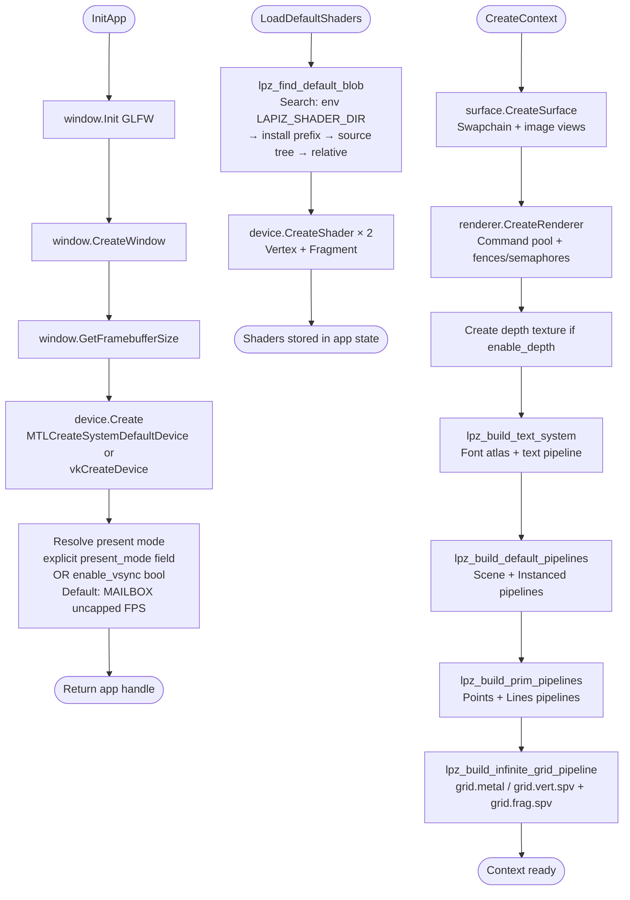

### 7.2 Main Loop

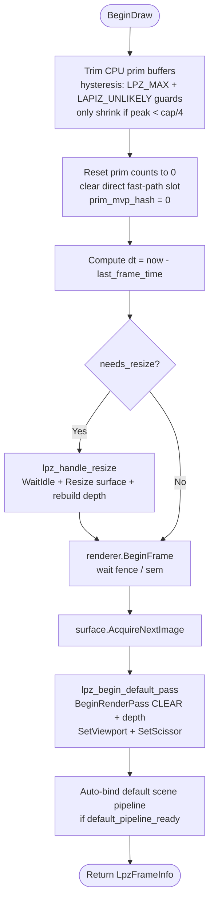

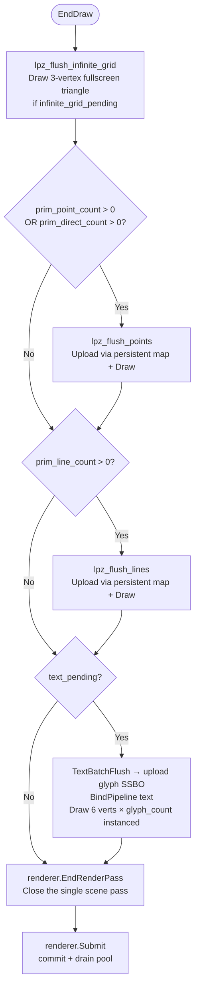

> **Key insight:** Text rendering, primitive draws, and the infinite grid all execute inside the **single main pass** before `EndRenderPass`. This was especially important for the text system: previously it opened a second pass with `LOAD_OP_LOAD`, which on TBDR GPUs (Apple Silicon) forces a full tile-memory evict and reload — the most expensive per-pass operation.

### 7.3 App State Summary

The `LpzAppState` struct (private to `lpz.c`) holds all implicit state. Key fields:

| Field Group | Fields | Purpose |
|---|---|---|
| **Core GPU** | `device`, `surface`, `renderer` | Main GPU objects |
| **Swapchain** | `current_swapchain_tex`, `current_frame_index` | Per-frame image |
| **Depth** | `depth_texture`, `enable_depth` | Optional depth buffer |
| **Timing** | `start_time`, `last_frame_time`, `dt`, `elapsed` | Frame delta time |
| **Primitives** | `prim_point_cpu[]`, `prim_line_cpu[]` | CPU staging arrays |
| **Prim GPU** | `point_buf`, `line_buf`, `point_bg`, `line_bg` | Ring-buffered SSBOs |
| **Prim persistent maps** | `point_map_valid[]`, `line_map_valid[]` | Per-slot map cache |
| **Prim fast path** | `prim_direct_pts`, `prim_direct_count` | Zero-copy single-call path |
| **MVP hash** | `prim_mvp_hash` | 64-bit fingerprint; skip memcpy on match |
| **Text** | `font`, `text_batch`, `text_pipeline`, `text_bg` | Text render system |
| **Pipelines** | `default_scene_pipeline`, `prim_point_pipeline`, `prim_line_pipeline` | Cached PSOs |
| **Infinite grid** | `infinite_grid_pipeline`, `infinite_grid_inv_view_proj[]`, `infinite_grid_vp_dirty` | Shader-based infinite grid |
| **Infinite grid fades** | `infinite_grid_near_fade`, `infinite_grid_far_fade` | Horizon fade distances (20/80 wu) |
| **Grid cache** | `grid_cache[]`, `grid_cache_valid` | Line geometry for bounded grid/axes |
| **Events** | `LpzEventQueue` (ring buffer, 256 cap) | Input event queue |

---

## 8. Explicit API — Full Pipeline Control

For advanced use, the complete GPU API is accessible via `GetAPI(app)` which returns a raw `LpzAPI*`. The caller then owns all object lifetimes.

### 8.1 Manual Render Loop

```c
LpzAPI *api = GetAPI(app);
lpz_device_t   dev      = GetDevice(app);
lpz_renderer_t renderer = GetRenderer(app);
lpz_surface_t  surface  = GetSurface(app);

// --- One-time setup ---
lpz_shader_t vs, fs;
api->device.CreateShader(dev, &vs_desc, &vs);
api->device.CreateShader(dev, &fs_desc, &fs);
api->device.CreatePipeline(dev, &pso_desc, &my_pipeline);
api->device.CreateBindGroupLayout(dev, &bgl_desc, &my_bgl);
api->device.CreateBuffer(dev, &buf_desc, &my_ubo);
api->device.CreateBindGroup(dev, &bg_desc, &my_bg);

// --- Per frame ---
while (Run(app)) {
    PollEvents(app);
    api->renderer.BeginFrame(renderer);
    uint32_t fi = api->renderer.GetCurrentFrameIndex(renderer);

    api->surface.AcquireNextImage(surface);
    lpz_texture_t swapTex = api->surface.GetCurrentTexture(surface);

    LpzColorAttachment ca = {
        .texture = swapTex,
        .load_op = LPZ_LOAD_OP_CLEAR,
        .store_op = LPZ_STORE_OP_STORE,
        .clear_color = {0.1f, 0.1f, 0.1f, 1.0f},
    };
    LpzRenderPassDesc pass = {
        .color_attachments = &ca,
        .color_attachment_count = 1,
    };
    api->renderer.BeginRenderPass(renderer, &pass);
    api->renderer.SetViewport(renderer, 0, 0, w, h, 0, 1);
    api->renderer.BindPipeline(renderer, my_pipeline);
    api->renderer.BindBindGroup(renderer, 0, my_bg, NULL, 0);
    api->renderer.PushConstants(renderer, LPZ_SHADER_STAGE_ALL_GRAPHICS,
                                 0, sizeof(my_pc), &my_pc);
    api->renderer.DrawIndexed(renderer, index_count, 1, 0, 0, 0);
    api->renderer.EndRenderPass(renderer);
    api->renderer.Submit(renderer, surface);
}

// --- Teardown ---
api->device.WaitIdle(dev);
api->device.DestroyBindGroup(my_bg);
api->device.DestroyPipeline(my_pipeline);
```

### 8.2 State Diffing — How Redundant GPU Commands Are Eliminated

Every `Bind*` and `Set*` function checks cached state before issuing the underlying GPU command:

```c
// BindPipeline (Vulkan):
if (renderer->activePipeline == pipeline) return;
renderer->activePipeline = pipeline;
vkCmdBindPipeline(cmd, pipeline->bindPoint, pipeline->pipeline);

// SetViewport:
if (renderer->viewportValid && memcmp(&renderer->cachedViewport, &vp, sizeof(vp)) == 0)
    return;
renderer->cachedViewport = vp;
renderer->viewportValid  = true;
vkCmdSetViewport(cmd, 0, 1, &vp);
```

State is reset to "unknown" at the start of every render pass, ensuring the first bind after `BeginRenderPass` always issues correctly.

### 8.3 Transfer Pass — Mesh Upload


### 8.4 Compute Pass (Extended API)

```c
api->rendererExt.BeginComputePass(renderer);
api->rendererExt.BindComputePipeline(renderer, compute_pipeline);
api->renderer.BindBindGroup(renderer, 0, compute_bg, NULL, 0);
api->rendererExt.DispatchCompute(renderer, group_x, group_y, group_z,
                                  thread_x, thread_y, thread_z);
api->rendererExt.EndComputePass(renderer);
```

On Metal 3+, `DispatchCompute` uses `dispatchThreads:threadsPerThreadgroup:` which automatically clips the last partial threadgroup. On Metal 2 it falls back to `dispatchThreadgroups:`, requiring the caller to round up counts.

---

## 9. Primitive Drawing System

### 9.1 Point & Line Batching

All `DrawPoint`, `DrawPointCloud`, `DrawLine`, and `DrawLineSegments` calls accumulate into CPU arrays. A single GPU upload + draw is issued per type in `EndDraw`.

```mermaid
flowchart TD
    DPC([DrawPointCloud]) --> HASH[lpz_mvp_hash view_proj\nXOR of bytes 0-7 and 56-63]
    HASH --> HCK{hash == prim_mvp_hash?}
    HCK -- Same → skip memcpy
    HCK -- Different --> COPY[memcpy prim_mvp\nupdate hash]
    COPY --> FP{First point call\nthis frame?}
    FP -- Yes --> DP[Fast path:\nStore pointer directly\nprim_direct_pts = points\nZero memcpy]
    FP -- No --> PUSH[lpz_cpu_push_points\nmemcpy into CPU buffer]
    DP & PUSH --> DONE([Done — no GPU work yet])

    FLP([lpz_flush_points in EndDraw]) --> PM{persistent map\nvalid for slot?}
    PM -- No → MapMemory + cache slot
    PM -- Yes → reuse
    PM --> GPU[memcpy into persistent mapped ptr]
    GPU --> BIND[BindPipeline · BindBindGroup · PushConstants]
    BIND --> DRAW[Draw count=N, instances=1]
```

#### MVP Hash

Rather than a 64-byte `memcmp` on every `DrawPoint*` / `DrawLine*` call, Lapiz computes a 64-bit fingerprint of the view-projection matrix and compares a single integer:

```c
static inline uint64_t lpz_mvp_hash(const void *m) {
    uint64_t a, b;
    memcpy(&a, (const char *)m,      8);   // bytes 0-7  (first two floats)
    memcpy(&b, (const char *)m + 56, 8);   // bytes 56-63 (last two floats)
    return a ^ b;
}
```

Any camera movement changes at least one of the sampled positions. The hash mismatch triggers a `memcpy` of the full 64-byte matrix; a hash match skips it entirely. Accepts `const void *` so both `float[16]` and `mat4` (`float(*)[4]`) pass without a cast.

### 9.2 GPU Buffer Growth Strategy

Point and line SSBOs use **power-of-two growth with a high-watermark trim heuristic**:

```c
// Growth: round up to next power of 2, minimum 64 elements
uint32_t cap = need_count > 1u
    ? 1u << (32u - (uint32_t)__builtin_clz(need_count - 1u))
    : 1u;
if (cap < 64u) cap = 64u;

// Trim in BeginDraw (only when peak dropped well below current cap):
if (LAPIZ_UNLIKELY(prim_point_cap_cpu > MIN_CAP)) {
    if (prim_point_peak < prim_point_cap_cpu / SHRINK_FACTOR) {
        uint32_t new_cap = LPZ_MAX(MIN_CAP, prim_point_peak * 2u);
        realloc(prim_point_cpu, new_cap * sizeof(LpzPoint));
    }
}
```

This prevents the pathological oscillation where a 1M-point workload would cause `trim(32MB → 8MB)` then `grow(8MB → 32MB)` on alternate frames.

### 9.3 Grid System

`DrawGrid` is the single unified entry point for all grid and axis rendering. It accepts an `LpzGridDesc` that independently controls each rendering mode:

```c
typedef struct LpzGridDesc {
    int          grid_size;  // bounded grid half-extent (lines at -N..+N)
    float        axis_size;  // axis arrow length from origin (0 = no axes)
    float        spacing;    // infinite grid cell size in world units
    float        thickness;  // line thickness in pixels (for bounded + axes)
    LpzGridFlags flags;      // combination of LpzGridFlags values
} LpzGridDesc;
```

Three rendering modes, combinable in any order:

| Flag | Mode | Implementation |
|---|---|---|
| `LPZ_GRID_DRAW_GRID` | Bounded XZ line grid | CPU line geometry, cached |
| `LPZ_GRID_DRAW_AXES` | Short axis arrows (+X red, +Y green, +Z blue) | CPU line geometry, part of same cache |
| `LPZ_GRID_INFINITE` | Shader-based infinite grid | Fullscreen triangle, depth OFF, deferred to EndDraw |

#### Bounded Grid Caching

The bounded line geometry (grid lines + axis arrows) is rebuilt only when `LpzGridDesc` fields change. `LPZ_GRID_INFINITE` is **masked out** of the cache key so switching between `LPZ_GRID_DRAW_ALL` and `LPZ_GRID_ALL` doesn't invalidate the CPU lines.

Centre lines (x=0, z=0) are rendered brighter (brightness 0.52 vs 0.28) and slightly thicker (0.75× vs 0.5× of thickness) than regular grid lines. They are not coloured — axis colours belong only to the short arrows drawn by `LPZ_GRID_DRAW_AXES`.

#### Infinite Grid (Shader-Based)

The infinite grid is drawn in `EndDraw` before point/line flushes, so it appears as a background layer. A single fullscreen triangle is emitted (no vertex buffer); the fragment shader computes the XZ plane intersection from interpolated world-space rays derived from the inverse view-projection matrix:

```mermaid
flowchart LR
    VS([grid_vertex\n3 vertices]) --> UP[Unproject NDC corners\nto near/far world-space rays\nusing inv_view_proj]
    UP --> INTERP[Interpolate ray\nper fragment]
    INTERP --> FS([grid_fragment])
    FS --> INT[Intersect ray with y=0 plane\nt = -near.y / far.y-near.y]
    INT --> GRID[Compute grid-space coords\ngxz = xz / spacing]
    GRID --> AA[fwidth-based AA\n abs fract - 0.5 / deriv]
    AA --> FADE[Distance fade\nsmoothstep near_fade far_fade]
    FADE --> OUT[Output grey pixel\nbrighter on centre lines]
```

The inverse view-projection matrix is computed in `DrawGrid` (early in the frame) and cached in `infinite_grid_inv_view_proj`. If `view_proj` hasn't changed since the last call (`memcmp` guard + `vp_dirty` flag), the inversion is skipped entirely — `glm_mat4_inv` only runs on camera movement.

Legacy wrappers `DrawGridAndAxes` and `DrawInfiniteGrid` are kept for source compatibility and forward to `DrawGrid`.

---

## 10. Text Rendering System

### 10.1 SDF Atlas Generation

The font atlas uses **Signed Distance Field** rasterization via `stb_truetype`. The resulting R8_UNORM texture encodes the distance to the nearest glyph edge at each pixel:

| Value | Meaning |
|---|---|
| `> 0.5` | Inside the glyph |
| `= 0.5` | Exactly on the edge |
| `< 0.5` | Outside (background) |
| `< 0.01` | Far outside — early `discard` |

### 10.2 Kern Table & Advance Cache

`LpzFontAtlasCreate` builds two lookup tables at atlas creation time, eliminating per-character stbtt calls from the hot path:

#### Kern Table

For contiguous codepoint sets ≤ 512 codepoints (the default printable ASCII set is 95 codepoints = 9,025 pairs ≈ 18 KB), a flat 2-D table is populated once:

```c
int16_t *kern_table;    // [prev_idx * cp_range + cur_idx], NULL if not built
uint32_t kern_cp_min;   // lowest codepoint in the table
uint32_t kern_cp_range; // table dimension
```

Per-character kern lookup collapses from a `stbtt_GetCodepointKernAdvance` binary search to a single array dereference:

```c
// Hot path (95%+ of characters):
uint32_t row = prev_cp - atlas->kern_cp_min;
uint32_t col = cp      - atlas->kern_cp_min;
kern = atlas->kern_table[row * atlas->kern_cp_range + col];

// Fallback (out-of-range codepoints such as emoji):
kern = stbtt_GetCodepointKernAdvance(&atlas->font_info, prev_cp, cp);
```

#### Scaled Advance Cache

```c
float *advance_scaled;  // advance_scaled[i] = glyphs[i].advance_width * font_scale
```

Precomputing `advance_width * font_scale` at atlas build time means `TextBatchAdd` only multiplies by the per-call `scale = font_size / atlas_size` instead of two separate multiplies. Indexed by `g - atlas->glyphs` (pointer difference into the sorted glyph array).

Both tables are freed in `LpzFontAtlasDestroy` via `LPZ_FREE`.

### 10.3 Fragment Shader Anti-Aliasing

```glsl
float sdf   = texture(sampler2D(u_atlas, u_sampler), v_uv).r;
if (sdf < 0.01) discard;               // early-out: far outside glyph

float w     = fwidth(sdf);             // screen-space derivative
float alpha = smoothstep(0.5-w, 0.5+w, sdf);  // AA band = ±1 pixel

if (alpha < 0.004) discard;            // discard SDF ringing artefacts
out_color = vec4(v_color.rgb, v_color.a * alpha);
```

`fwidth(sdf)` automatically scales the AA band to screen-space texel size, giving correct antialiasing at any text scale, rotation, or perspective projection — no manual tuning.

### 10.4 Glyph Instance Layout

Each glyph is a `LpzGlyphInstance` (64 bytes, 16 × float) in the ring-buffered SSBO. The vertex shader generates all 6 quad corners from a `CORNERS[6]` constant array indexed by `gl_VertexIndex`, with NDC conversion using a single FMA:

```glsl
// NDC conversion with Y-flip baked in:
vec2 ndc = fma(screen_pos, vec2(2.0, -2.0) / g.screen, vec2(-1.0, 1.0));
```

### 10.5 Persistent Glyph Buffer Mapping

`TextBatchFlush` maps each ring-buffer slot once and reuses the pointer:

```c
if (!batch->map_valid[slot]) {
    mapped = Lpz.device.MapMemory(device, batch->gpu_buffer, frame_index);
    batch->mapped_ptrs[slot] = mapped;
    batch->map_valid[slot]   = (mapped != NULL);
}
if (!mapped) return;
memcpy(mapped, batch->cpu, (size_t)batch->glyph_count * sizeof(LpzGlyphInstance));
```

This was the original motivation for the pattern now applied to all three dynamic SSBOs.

---

## 11. Resource Management & Lifecycle

### 11.1 Full Lifecycle Diagram

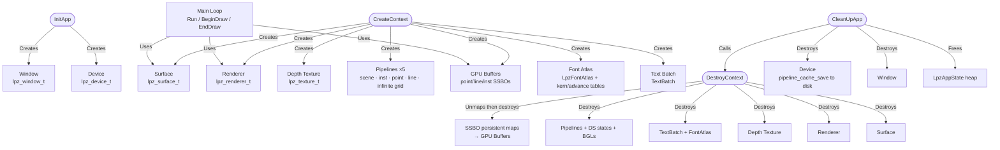

### 11.2 Object Ownership Rules

| Object | Owner | When to Destroy |
|---|---|---|
| `lpz_device_t` | App / `CleanUpApp` | After all other GPU objects |
| `lpz_surface_t` | `CreateContext` / `DestroyContext` | Before device |
| `lpz_renderer_t` | `CreateContext` / `DestroyContext` | Before device, after surface |
| `lpz_pipeline_t` | Caller | Anytime after `WaitIdle` |
| `lpz_buffer_t` | Caller | Anytime after `WaitIdle`; unmap first if persistently mapped |
| `lpz_texture_t` | Caller | Anytime after `WaitIdle` |
| `lpz_bind_group_t` | Caller | Anytime after `WaitIdle` |
| `Mesh.vb / Mesh.ib` | Caller via `DestroyMesh` | Anytime after `WaitIdle` (CPU memory only; vb/ib must be destroyed separately via `Lpz.device.DestroyBuffer`) |

#### `geometry.h` — Extern Constant Arrays

The built-in primitive geometry arrays (`TRIANGLE_VERTICES`, `QUAD_VERTICES`, `CUBE_VERTICES`, and their index counterparts) are declared `extern const` in `geometry.h` and defined once in `geometry.c`. This avoids the `static const` pattern that would cause a fresh copy of each array to be emitted in every translation unit that includes the header.

### 11.3 Synchronization Summary

| Mechanism | Used For | Backend |
|---|---|---|
| `dispatch_semaphore` / POSIX `sem_t` | Frame-in-flight CPU pacing | Metal |
| `VkFence` (pre-signaled) | Frame-in-flight CPU pacing | Vulkan |
| `VkSemaphore` (imageAvailable) | Swapchain acquire → render sync | Vulkan |
| `VkSemaphore` (renderFinished) | Render → present sync | Vulkan |
| `vkDeviceWaitIdle` | Resize operations only | Vulkan |
| `_Atomic uint32_t` | Draw counter (stats only, no ordering) | Both |
| `@autoreleasepool` | ObjC teardown outside active pool | Metal |
| Deferred free queue | GPU object lifetime with retainedReferences=NO | Metal |
| Persistent SSBO maps | Point / line / instance / text buffer reuse | Both |

---

## 12. Backend Comparison Reference

### Feature Parity Table

| Feature | Metal | Vulkan |
|---|---|---|
| Dynamic rendering (no render pass objects) | Native — `MTLRenderCommandEncoder` | `VK_KHR_dynamic_rendering` (1.3 core) |
| Pipeline caching | `MTLBinaryArchive` (Metal 3+) | `VkPipelineCache` (always, disk-persisted) |
| Command buffer pre-allocation | Reused descriptor (`cbDesc`) | Pre-allocated per-frame `VkCommandBuffer[3]` |
| Mesh shaders | `drawMeshThreadgroups:` (Metal 3+, Apple7+) | `VK_EXT_mesh_shader` |
| Argument tables / descriptor buffers | `MTL4ArgumentTable` (Metal 4+) | `VK_EXT_descriptor_buffer` |
| Residency hints | `MTLResidencySet` (Metal 4+) | N/A |
| Sync2 barriers | Automatic hazard tracking | `VK_KHR_synchronization2` / 1.3 core |
| Transfer queue | Graphics queue (Metal only has one) | Dedicated DMA queue when available |
| GPU timeline | `MTLSharedEvent` | `VkFence` + `VkSemaphore` |
| Image layout tracking | N/A (automatic) | Per-texture `currentLayout` + `layoutKnown` |
| Frame arena size | 64 KB (`LPZ_FRAME_ARENA_SIZE` from `internals.h`) | 64 KB (`LPZ_FRAME_ARENA_SIZE` from `internals.h`) |
| Atomic draw counter | `_Atomic uint32_t`, relaxed | `_Atomic uint32_t`, relaxed |
| Present modes | FIFO / non-FIFO via `displaySyncEnabled` | FIFO / MAILBOX / IMMEDIATE (with fallback) |
| Persistent SSBO mapping | ✓ (point, line, inst, text) | ✓ (point, line, inst, text) |
| Kern table cache | ✓ (built at atlas create time) | ✓ (built at atlas create time) |
| MVP hash | ✓ (64-bit XOR fingerprint) | ✓ (64-bit XOR fingerprint) |

### Per-Frame Cost Comparison

| Operation | Metal | Vulkan |
|---|---|---|
| Frame synchronization | `dispatch_semaphore_wait` | `vkWaitForFences` |
| Arena reset | `arenaOffset = 0` (1 store) | `arenaOffset = 0` (1 store) |
| Command buffer begin | `commandBufferWithDescriptor:` (reused desc) | `vkResetCommandPool` + `vkBeginCommandBuffer` |
| Render pass begin | `renderCommandEncoderWithDescriptor:` | `vkCmdBeginRenderingKHR` |
| State reset after pass | `lpz_renderer_reset_frame_state` | `lpz_vk_renderer_reset_state` |
| SSBO upload (per frame) | `memcpy` into persistent mapped ptr | `memcpy` into persistent mapped ptr |
| MVP matrix check | 64-bit hash compare | 64-bit hash compare |
| Submit | `commit` + `addCompletedHandler` | `vkQueueSubmit` |
| Present | `presentDrawable:` (inside commit) | `vkQueuePresentKHR` |
| Pool teardown | `NSAutoreleasePool drain` | N/A |

### Vulkan Barrier Strategy

Lapiz uses `VK_KHR_synchronization2` (Vulkan 1.3 core) when available, falling back to the legacy `vkCmdPipelineBarrier`:

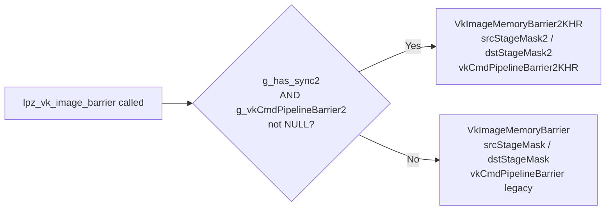

Sync2 allows more precise stage masks and is required for correct mipmap generation on Vulkan 1.3 drivers.